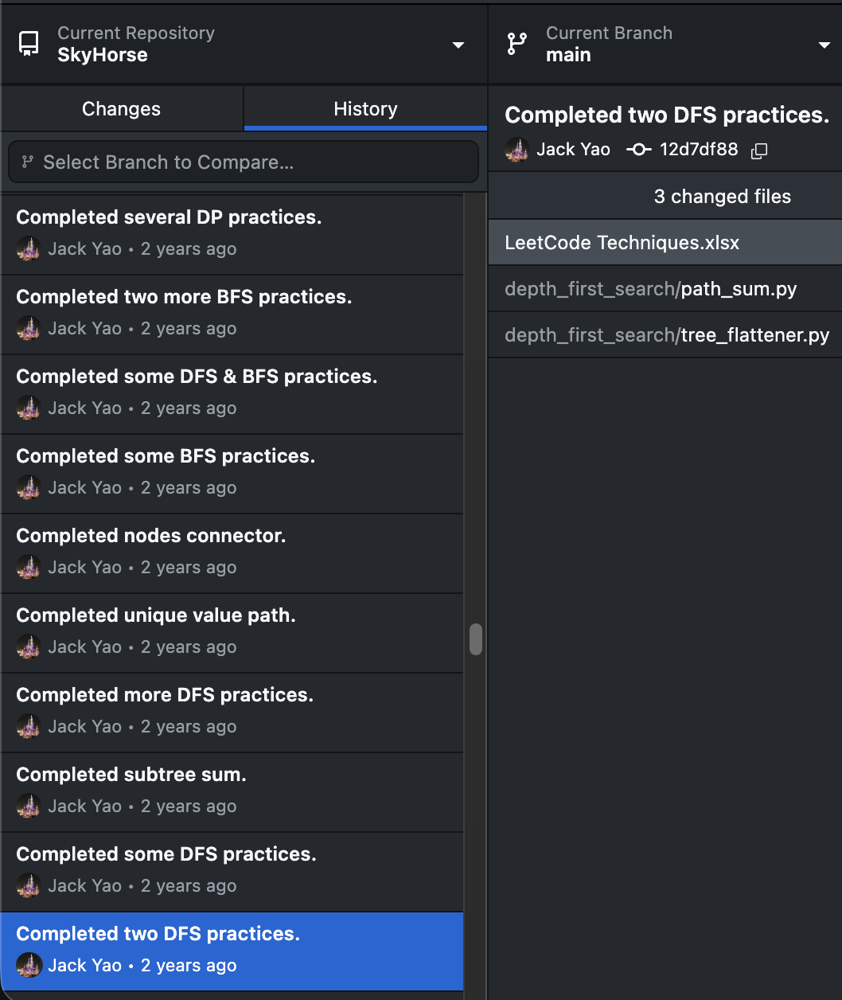

# 🏇 SkyHorse (天码行空)

## Repo's Origin

Back in early 2024, when I first created this repository,
my only goal was to archive all my data structures and algorithm practice code. 

As a complete beginner stepping into data structures and algorithms at that time,
I was having big doubt, constantly questioning whether I could survive.
Navigating Professor Tim Roughgarden's lectures was really a brain-melting challenge 🧠.

## Journey of Evolution
Two years have flashed by me so fast. 

With my total LeetCode Accepted (AC) count coming past 480,
and the number of conquered Hard problems reaching the 200+ milestone,
my feel with data structures and algorithms has fundamentally transformed. 

I used to think of myself as someone who just preferred living a chill life and disliked using my brain.
Yet, without realizing it, I now find my mind entirely locked in.

I dedicate quite some time to solving untouched LeetCode Hard problems,
upgrading absolute limits of execution speed, and even refining code architecture just to be cleaner. 

It is very hard to describe what is going on in my mind,
but I know for sure that problem-solving has become a big part of who I am.

## [Present: SkyHorse](https://starsexpress.github.io/SkyHorse/)
One day, as I was casually scrolling through my repository's history
and noticed it had crossed 200+ commits, a thought hit me: __"Why stop here?"__

I decided to start writing detailed problem explanations to document
my intuition and thought processes when faced with complex problems.

A lot of times, these breakthroughs were a product of late realizations
that only truly appeared after tackling a problem for the tenth time.

Though these growths arrived late, perhaps this is exactly why they possess a
more matured depth—much like a fine wine that only improves with time 😄.
