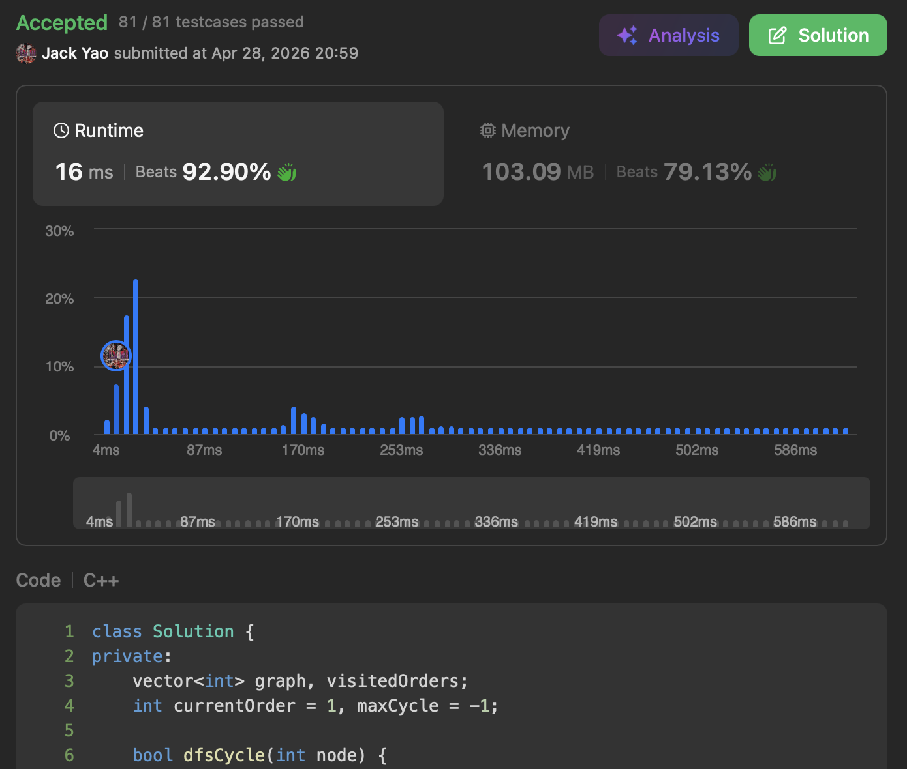

import Tabs from '@theme/Tabs';
import TabItem from '@theme/TabItem';
import CodeBlock from '@theme/CodeBlock';
import CppCode from './longest_cycle.cpp?raw';
import PyCode from './longest_cycle.py?raw';


### [Longest Cycle in a Graph](https://leetcode.com/problems/longest-cycle-in-a-graph/description/)
经典的环识别题 想当然耳开DFS最直观啰

这道题好处是 图上$n$个点标签是$0$到$n - 1$非负整数

直接拿```vector<int>```来做访问顺序的追踪表即可

用```unordered_map<int, int>```会慢很多......🐢


### 环何时成形？先把这个想清楚
当我们在递归有向图的过程中 来到某个点$u$

若$u$无出边 自然就是个死胡同了 点$u$不会在环内

那么假如$u$有条指向点$v$的出边呢？目前点$v$有三种可能性：

I. 仍未被访问过🔴

II. 正在递归栈上还没闪人🟡

III. 进过且登出递归栈了🟢

大家想想看 哪个状态会是环成形的那瞬间呢？

答案是中间的状态II. 正在递归栈上还没闪人🟡

__这就是恭喜环成形的那瞬间🎊__

__$(u, v)$是这个新生的环$C$ 最后的那块拼图🧩__

点$v$是环的起点 终点是点$u$🏁 环$C$的长度便是 __$d[u] + 1 - d[v]$__

其中$d[u]$和$d[v]$分别是 __点$u$和点$v$的访问顺序__

由于题目要求我们计算最长的环长度 __每当有个环刚成形了__

我们就要拿 __$d[u] + 1 - d[v]$和已知的历史最高值__ 来比较

青出于蓝的话便更新历史新高值


### 方便管理的小技巧
当然有个小细节可注意下 __就是为了快速区分前面说的II.和III.俩状态__

我习惯在```visitedOrders```这个整数阵列上 采取几种不同标记：

1. -1：点未被访问过🔴
2. 正整数：点正在递归栈上还没闪人🟡这正是点的访问顺序
3. -2：点已经进过且登出递归栈了🟢


每个点和每条边都只会刚好经过一遍 时间复杂度$O(V + E)$

空间复杂度也和点与边数量呈线性关系 有$O(V + E)$

<Tabs>
  <TabItem value="cpp" label="C++" default>
    <CodeBlock language="cpp">{CppCode}</CodeBlock>
  </TabItem>

  <TabItem value="python" label="Python">
    <CodeBlock language="python">{PyCode}</CodeBlock>
  </TabItem>
</Tabs>


### 延伸问题
[若你想清楚了第2360问，那就来吧😉](https://starsexpress.github.io/SkyHorse/docs/dfs/2876_hard/visited_nodes)
