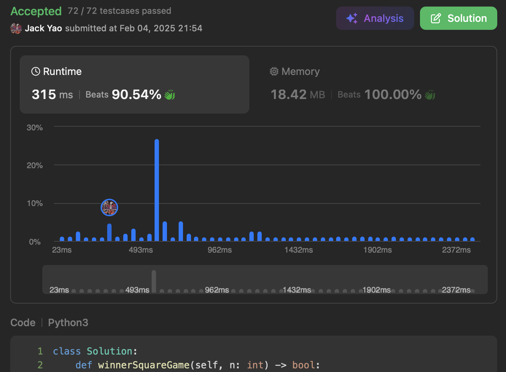

import Tabs from '@theme/Tabs';
import TabItem from '@theme/TabItem';
import CodeBlock from '@theme/CodeBlock';
import CppCode from './perfect_stone_game.cpp?raw';
import PyCode from './perfect_stone_game.py?raw';

## [Stone Game IV](https://leetcode.com/problems/stone-game-iv/description/)
这次的动态规划题 和往常的DP题稍微有点不一样

多少需要用到一些数学概念 不是完全0数学

## 奇数VS.偶数
从题目叙述 我们能注意到 只要当前上场的玩家

拿走一把共计 __某非零完全平方数__ 的石头

__使得台面上没剩下任何石头 这个玩家就赢了__

因为Alice又是老样子 照惯例先攻

于是若初始的石头总数能写成 __奇数个非零完全平方数的和__

那么Alice就能赢 反之她必输无疑

## 状态转移方程
从上面的观察 我们已经注意到

对于任何一个迭代到的剩馀石子数量$i$

我们仅需要问：__此$i$可否拆成奇数个非零完全平方数的和__

而问题的解答 写成状态转移方程便是 对于$1 \leq i$的$i \in N$：

$$
squares\_counts[i] =
\begin{cases}
    1, & \text{if i is a perfect square itself} \\
    1, & \text{if } \exists \, perfect\_square \in [1, i) \text{ s.t. } squares\_counts[i - perfect\_square] = 0 \\ 
    0, & \text{otherwise} 
\end{cases}
$$

大括号中 第一和第三行非常显而易见 关键在

第二行的理念：$squares\_counts[i - perfect\_square] = 0$

__说明$i - perfect\_square$颗石子 只能写成偶数个非零完全平方数的和__

__而再加上抽走$perfect\_square$颗石子的这步操作__

__使得$i$颗石子只能写成奇数个非零完全平方数的和 Alice必胜条件__

于是我们拿到能写代码的状态转移方程啰👌

<Tabs>
  <TabItem value="cpp" label="C++">
    <CodeBlock language="cpp">{CppCode}</CodeBlock>
  </TabItem>

  <TabItem value="python" label="Python" default>
    <CodeBlock language="python">{PyCode}</CodeBlock>
  </TabItem>
</Tabs>

时间复杂度比较微妙 是$O(n\sqrt{n})$ 其中$n$是初始石子数量

每次迭代到的石子数量$i$ 都要检查所有$\leq i$的非零完全平方数

空间复杂度就比较简单 是$O(n)$
