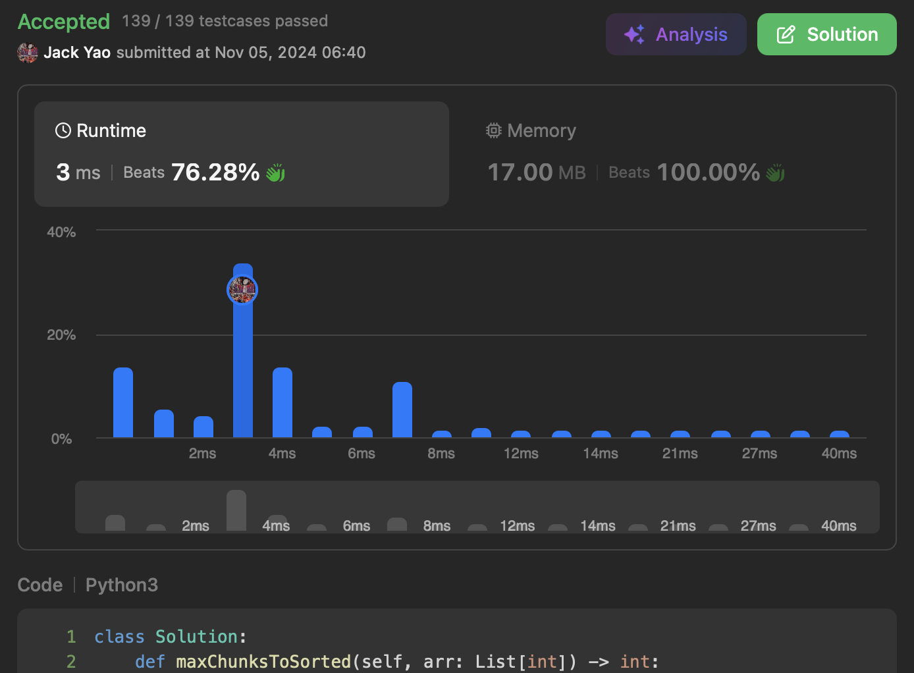

import Tabs from '@theme/Tabs';
import TabItem from '@theme/TabItem';
import CodeBlock from '@theme/CodeBlock';
import CppCodePrefix from './max_chunks_prefix_version.cpp?raw';
import PyCodePrefix from './max_chunks_prefix_version.py?raw';
import CppCodeStack from './max_chunks_stack_version.cpp?raw';
import PyCodeStack from './max_chunks_stack_version.py?raw';


## [Max Chunks To Make Sorted II](https://leetcode.com/problems/max-chunks-to-make-sorted-ii/description/)
此道难题对我来讲 有股物是人非的感觉

2024年底时我初次写这题 AC了

2026上半年再回来写 又是AC

但这两次的解法 用不同的数据结构

明明就都同一个人写的😅


## 一、2024年底：前缀与后缀
### 剑盾之争
首先我们不妨思考一下 相邻两个Chunks

各自内部排序后 能直接拼接成有序数组

这说明什么呢？非常明显的

__$max(Chunk_{left}) \leq min(Chunk_{right})$__

把$max(Chunk_{left})$想像成 __剑🗡__️

$min(Chunk_{right})$是 __盾🛡__

一面盾牌️如何金刚不坏体？

__肯定是这盾最弱的部位 竟然不弱于最强的剑尖__

### 先往右再向左
于是对于长度$n$的数组$nums$ (题目叫$arr$ 但我习惯$nums$咯)

每个满足$1 \leq i < n$的索引$i$ 我们来检查下：

__$max(nums[:i]) \leq min(nums[i:])$成立吗？__

有的话 索引$i$便能作为 __熔断点__

体现的是在索引$i$这边将数组分成两块

各自排序后 再拼接起来 肯定有序不会乱掉

说到这边 大家应该猜到了 我们得 __先向左遍历__

开一个```prefix_maxs```数组 记住每个$max(nums[:i])$

接著再从右端往回走 路上靠```suffix_min```追踪$min(nums[i:])$

每当$max(nums[:i]) \leq min(nums[i:])$成立

就给```max_chunks```加1 但是要记得

### __```max_chunks```的起始值不是0 而是1__
__哪怕严格递减的$nums$ 也能被看作一个Chunk__

<Tabs>
  <TabItem value="cpp" label="C++">
    <CodeBlock language="cpp">{CppCodePrefix}</CodeBlock>
  </TabItem>
  <TabItem value="python" label="Python" default>
    <CodeBlock language="python">{PyCodePrefix}</CodeBlock>
  </TabItem>
</Tabs>


时间复杂度$O(n)$ 空间复杂度$O(n)$ 跑两遍for回圈

过了一年半后 我想到下方的另一套模式......


## 二、2026上半年：单调递增栈
### 任何数字想挂帅Chunk的资格
观察前一段的代码 就是```prefix_maxs```不停 __扩充老大__ 的过程

是不是有意识到 可能是什么环境

__让一个老大做不了某Chunk的最大值__？

试想一下这个场景：$0 \leq j < k < l < n$

$nums[j] \leq nums[k]$达成

$max(nums[:j + 1]) = nums[j]$达成

$max(nums[:k + 1]) = nums[k]$达成

看到这 $nums[j]$领军$nums[:j + 1]$这$Chunk_j$

$nums[k]$领军的叫$Chunk_k$ 即$nums[j + 1:k + 1]$ 皆大欢喜

### 人生就是有这么个但是
现如今来了个$nums[l]$ 满足$nums[l] < nums[j] \leq nums[k]$

刚才说过 $k < l$ 换言之 $nums[l]$在$nums[j]$和$nums[k]$右方

嗅觉敏锐的我们 马上有警觉：

I. 如果不让$nums[l]$去$nums[k]$挂帅的$Chunk_k$

那么$nums[l]$和右边的数字组出$Chunk_y$ 排序好后

碰到从左方来的$Chunk_j$ __就出现$nums[j]$和$nums[l]$错位啦__

II. 好 那$nums[l]$让加入$nums[k]$挂帅的$Chunk_k$

可是$Chunk_k$排序好后 碰到左方来的$Chunk_j$

__还是出现$nums[j]$和$nums[l]$错位啦__

从这两条路 我们直接能说

$nums[l]$和$nums[j]$都必须进入$Chunk_k$

让$nums[l]$和$nums[j]$分家就是有问题

这正是$nums[j]$因此必须下课 做不了老大的根源

### 单调性用起来
于是我们得出一个结论 每当目前遍历的$nums[i]$

__比```prefix_maxs[-1]```小__ 我们要：

(1). 先```pop()``` 请```prefix_maxs[-1]```出来

(2). 接著若```prefix_maxs```还没空

就继续检查是否```prefix_maxs[-1] > nums[i]``` 是的话 重回(2)这步

不是的话 把最开始被```pop()```的那```prefix_maxs[-1]``` 放回prefix_maxs右端

__这不就是单调递增栈的行为吗👌__

遍历结束后 看栈内还剩多少元素 假设剩下$s$个

__就是有$s$个毫无瑕疵的Chunks老大 回传$s$即可__

<Tabs>
  <TabItem value="cpp" label="C++">
    <CodeBlock language="cpp">{CppCodeStack}</CodeBlock>
  </TabItem>
  <TabItem value="python" label="Python" default>
    <CodeBlock language="python">{PyCodeStack}</CodeBlock>
  </TabItem>
</Tabs>

本题用栈和前缀思维 都是时间空间一起$O(n)$ 但栈开一遍for回圈而已
