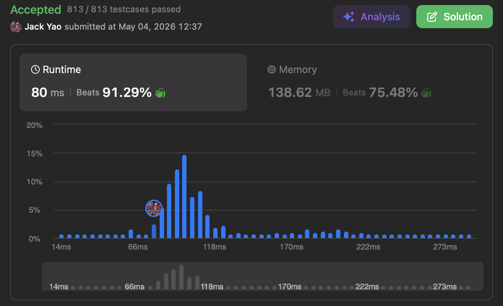

import Tabs from '@theme/Tabs';
import TabItem from '@theme/TabItem';
import CodeBlock from '@theme/CodeBlock';
import CppCode from './good_partitions.cpp?raw';
import PyCode from './good_partitions.py?raw';


### [Count the Number of Good Partitions](https://leetcode.com/problems/count-the-number-of-good-partitions/description/)
直接进入正题 这次的任务是将 __输入的数组分割成一个或多个连续子数组__

__限定任两个子数组不能共享相同的数字__ 达成此条件才叫好的分割法

要回传的正整数就是代表著究竟有多少种好分割法

### 不能脚踏两条船？那么......嘿嘿
帮翻译这条限制：同一个数字 把最早和最晚登场的索引$i$和$j$找到手 __$i$和$j$这俩索引必须同属一个集团__

__换言之 我们需要追踪一个数字最晚登场的索引是多少__ 追踪好后 这样子

方能顺势启动```scanIdx```和```boundaryIdx```两个索引

```boundaryIdx```代表著 __当前还没定案的集团$G_i$ 其右端边界__ 所在的索引位置

```scanIdx```则是用来 __递增扫描__ 属于$G_i$的索引中 __那些还没被检查过的索引__

检查什么呢？__检查这个索引上对位的数字$x$ 它最晚登场的索引$j$是否大过了```boundaryIdx```__

一旦大过了```boundaryIdx``` 那么必须让```boundaryIdx``` = $j$

__才能令$x$展现忠诚 乖乖留守同一个集团 也就是当前还没成形的这个$G_i$ 确保$x$不脚踏两条船😏__

反过来说 ```scanIdx```递增扫描的过程 __倘若有一刻竟然变成$>$```boundaryIdx```__

__自然意味著集团$P_i$彻底结业 能停止成长了__ 亦能为此更新已成形的总集团数量

### 已成形的总集团数量又代表什么呢？
假设总集团数量有$k$个 那它们中间有$k - 1$个间隙

每一个间隙都面临两条路：__留著分离相邻两个集团；或者消失 好让相邻的集团合而为一__

__由此答案就出来啦！好分割法总数 = $2^{k - 1}$ ✌️__

题外话 咱们三国时期的曹丞相当时听了庞统的连环计 __选择了最极端的一种分割法__

__拿掉全部间隙 把船队全用铁鍊拴在一块__ 结果就是赤壁之战被一把火烧光......

说回正题 因为分割法总数是 __$O(2^k)$__ 这种规模的体量 因此需要开一个$10^9 + 7$的模来防止数值爆炸

甚至计算指数$2^{k - 1}$的过程 也要用 __模幂运算__ 来计算比较保险


哈希表存取每个数字最晚登场索引 空间复杂度O(n)

__模幂运算采用迭代方式实现 空间复杂度仅O(1)__

每个索引都是被```scanIdx```扫描一次 又建哈希表时也被刚好扫描一次 时间复杂度是O(n)

模幂运算的时间复杂度是$O(\log (k - 1))$ $k$为成形的总集团数量

__但是$k$最多就是到$n$ 因此模幂运算时间复杂度其实是$O(\log n)$__

最后时空复杂度均为O(n) 轻巧地下庄拿AC👌👌

<Tabs>
  <TabItem value="cpp" label="C++" default>
    <CodeBlock language="cpp">{CppCode}</CodeBlock>
  </TabItem>

  <TabItem value="python" label="Python">
    <CodeBlock language="python">{PyCode}</CodeBlock>
  </TabItem>
</Tabs>
