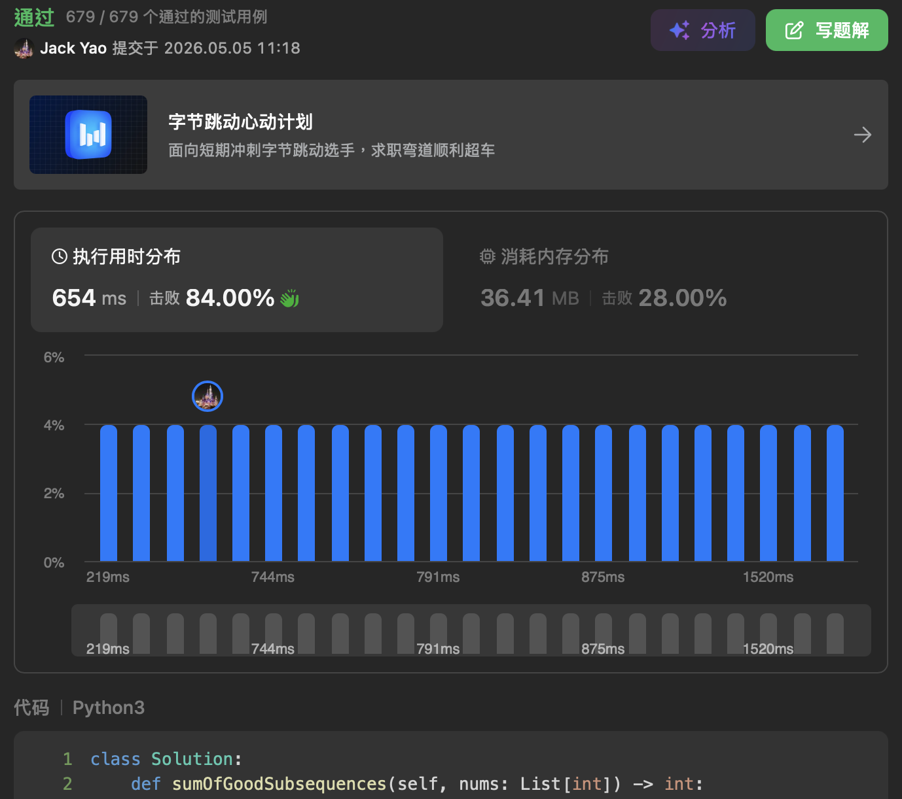

import Tabs from '@theme/Tabs';
import TabItem from '@theme/TabItem';
import CodeBlock from '@theme/CodeBlock';
import CppCode from './good_subsequences_sum.cpp?raw';
import PyCode from './good_subsequences_sum.py?raw';

### [Sum of Good Subsequences](https://leetcode.cn/problems/sum-of-good-subsequences/description/)
也是个难搞的题目呀 __通过率36%一带 明显是难题中比较硬的那组__

不过这种子序列计数求和题 还是能和我们给子数组计数异曲同工

正式讲第3351题之前 我先简单说下子数组和子序列的像与不像

### 子数组 子序列 同中存异 异中求同
#### A. 同：遍历到的元素尝试做『尾巴』
搜寻子数组时 我们让遍历到的索引$i$尝试做子数组尾

企图看有多少个结尾在索引$i$的子数组

__那同理__ 亦能让遍历到的索引$i$做子序列尾呀

这样一来回圈逻辑清楚 __再来也不会重复计算__

#### B. 异：如何承上起下把家族传下去
双方最主要的分歧之一就在这儿 __子数组讲究索引绝对的连续性__

__索引$i$只能帮所有结尾在索引$i - 1$的子数组延伸__

__但子序列允许索引之间跳著拿 爱拿谁就拿谁 相对顺序没变就好__

换句话说 __索引$i$能衔接所有结尾在索引$0, ..., i - 1$的子序列__

### 现在有猜出3351道题咋整了齁
对于每个目前遍历到的索引$i$ 我们要看在前面$i$多次遍历中已经

出现过多少个 __结尾值是$nums[i] - 1$或$nums[i] + 1$的子序列__

因为题目有说 每个子序列 __相邻元素__ 必须恰好有 __1的绝对差__

假设前面$i$多次遍历中有

I. $j$个结尾值是$nums[i] - 1$的子序列 所有子序列总和$Sum_{nums[i] - 1}$

II. $k$个结尾值是$nums[i] + 1$的子序列 所有子序列总和$Sum_{nums[i] + 1}$

那么我们立马判断出两个事实：

1. 结尾是 __在索引$i$__ 的子序列数量有$j + k + 1$个

2. __结尾值是$nums[i]$__ 的子序列数量 __净增加__ $j + k + 1$个

注意1.和2.这两番话用语不太一样 因为 __只有一个编号叫$i^{th}$的索引__

但是在访问索引$i$之前 可能早有 __结尾值是$nums[i]$的子序列成形__

大家先细品 想清楚了这两句话 再往下阅读～～

-----------------------不要急😏慢慢來-----------------------

说回$j + k + 1$ 这$+ 1$是哪冒出来的呢？

别忘了 我们在索引$i$上 __也有权选择抛弃继承__

__白手起家 让$nums[i]$自成一个子序列😛__

计数搞定了 那求和就好办了 我们现在让：

(1). __结尾值$nums[i]$__ 的子序列数量

__净增加__ $j + k + 1$个

(2). __结尾值$nums[i]$__ 的子序列总和

__净增加__ $(Sum_{nums[i] - 1} + nums[i] * j) + (Sum_{nums[i] + 1} + nums[i] * k) + (nums[i])$

这边稍微复杂些 我放三对括号来逐一介绍在干嘛😄

a. 左首括号是索引$i$ __基于结尾值是$nums[i] - 1$的所有子序列做延伸__

索引$i$继承结尾值是$nums[i] - 1$的所有子序列总和$Sum_{nums[i] - 1}$

$j$个结尾值$nums[i] - 1$的子序列 都得被$nums[i]$照顾

b. 中路括号是索引$i$ __基于结尾值是$nums[i] + 1$的所有子序列做延伸__

索引$i$继承结尾值是$nums[i] + 1$的所有子序列总和$Sum_{nums[i] + 1}$

$k$个结尾值$nums[i] + 1$的子序列 都得被$nums[i]$照顾

c. 右首括号是索引$i$ __让$nums[i]$自成一个子序列__

因此a.、b.、c.三部分加起来就是 __结尾值$nums[i]$的子序列总和『淨增量』__

等到遍历结束后我们就能把

__不同子序列结尾值__ 它们各自的子序列总和全部加起来

按规定除上$10^9 + 7$这个模控制大小就好了

但是大家应该察觉到了 __子序列数量是O($2^n$)级别的__

我们整个过程 __一直使用子序列数量运算子序列总和__

__因此计算过程其实就要在子序列数量跟总和上__

__拿模来控制大小 避免数值爆炸溢位😉__

☝️顺利控制到O(n)的时间和空间复杂度啰😺

<Tabs>
  <TabItem value="cpp" label="C++">
    <CodeBlock language="cpp">{CppCode}</CodeBlock>
  </TabItem>

  <TabItem value="python" label="Python" default>
    <CodeBlock language="python">{PyCode}</CodeBlock>
  </TabItem>
</Tabs>

### 延伸问题
如果题目要求的不是子序列 而是子数组 最佳的时间和空间复杂度会有什么变化
