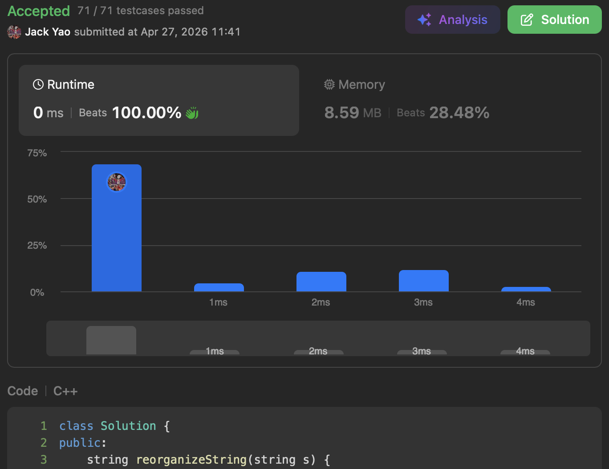

import Tabs from '@theme/Tabs';
import TabItem from '@theme/TabItem';
import CodeBlock from '@theme/CodeBlock';
import CppCode from './reorganized_string.cpp?raw';
import PyCode from './reorganized_string.py?raw';

## [原题在这边](https://leetcode.com/problems/reorganize-string/description/)
### Sanity Check非常重要的
思路不难 我们先把每个字符出现的次数统计出来

好好地来一个 __节省未来时间的防呆检查__：

$\text{某个字符的出现频率} - \text{其他字符出现频率之和} \geq$ 2

__那这绝对就没招了__ 只能回个"" 没法重组出相邻字符不重复字串

__至于如何画出筛选门槛呢？__ 若$n$为字串长度

$\frac{1 + n}{2} - (n - \frac{1 + n}{2}) = 1$

字符出现频率在$\frac{1 + n}{2}$时还没犯规

但如果再加$\frac{1}{2}$变成$\frac{2 + n}{2}$

刚才的差值就变成是2 犯规啦

因此防呆检查要判断有无字符出现频率 __超过$\frac{1 + n}{2}$__

### 确认Sanity Check没事后
把全部字符放在一个Max Heap里 这大堆中每个元素都是 __(剩馀次数, 字符)__ 这样的格式

只要大堆还有起码两元素

就先把堆顶元素$(Count_1, Char_1)$取出来

接著再取一遍堆顶元素$(Count_2, Char_2)$

__然后每次俩字符都各只用一个而已__

把$Char_1$和$Char_2$拼接到未完成的`reshapedString`上

再请$(Count_1 - 1, Char_1)$入堆 __前提是$Count_1 - 1 > 0$__

__毕竟大堆是拿来给还没耗光的字符啰__

$(Count_2 - 1, Char_2)$同理

## 何时收手呢✋🏻
就是大堆内只剩下 __零或一个__ 元素时：

I. 没剩元素肯定能立刻回传`reshapedString`

II. 要是还有剩 肯定等于1 __因为上方有通过Sanity Check啦__

把元素上字符接到`reshapedString`末尾即可回传

<Tabs>
  <TabItem value="cpp" label="C++" default>
    <CodeBlock language="cpp">{CppCode}</CodeBlock>
  </TabItem>

  <TabItem value="python" label="Python">
    <CodeBlock language="python">{PyCode}</CodeBlock>
  </TabItem>
</Tabs>

时间复杂度：$O(nlogk)$ 字串长度$n$ 字符种类数$k$

空间复杂度：$O(n)$ $n$是字串长度
