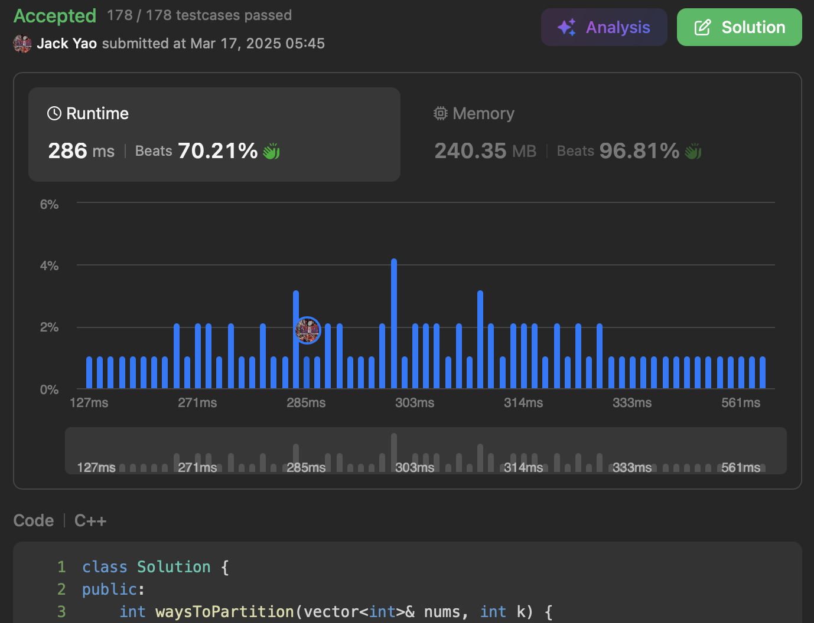

import Tabs from '@theme/Tabs';
import TabItem from '@theme/TabItem';
import CodeBlock from '@theme/CodeBlock';
import CppCode from './partitions_count.cpp?raw';
import PyCode from './partitions_count.py?raw';


## [Maximum Number of Ways to Partition an Array](https://leetcode.com/problems/maximum-number-of-ways-to-partition-an-array/description/)
非常烧脑的一题 我其实前八次尝试全错😆

那时候对于明显复杂的题目

比如通过率才36%左右的2025题

很容易陷入乱枪打鸟

我后来才懂得踩刹车 冷静观察再动手


## Max Partitions Count的出厂值
题目有说 我们能选择什么元素都不动

首先就拿原始那长度$n$的数组来看

有多少个$1 \leq i < n$的索引$i$做到

__$sum(nums[:i]) = sum(nums[i:]$__

因此Max Partitions Count的出厂值

便是$C = \Sigma_{i = 1}^{n - 1} 1(sum(nums[:i]) = sum(nums[i:]))$


## 难在能去改某一索引上的元素
然而题目还有说 我们也能选择 __刚好一个__ 索引$j$

__把索引$j$上的元素改成输入的变量$k$__

言下之意 便是我们得看看究竟哪个$j$能够

$C' = max_{j} \Sigma_{i = 1}^{n - 1} 1(sum(nums'[:i]) = sum(nums'[i:]))$

__$nums'$和$nums$唯一的区别就在$nums'[j] = k$__

最后再回传$max(C, C')$作为答案


## 寻找C'
### 前后缀差值的概念
首先储备一个叫做```rightDiffCounts```的哈希表

还有叫做```pivotIdx```的索引 题目有定义

__```pivotIdx```必须从1开始 且小于$n$__

因此```pivotIdx```沿著1一路访问到$n - 1$的路上

要计算 __前后缀差值__ $D =$ sum(nums[:```pivotIdx```]) - sum(nums[```pivotIdx```:])

并在```rightDiffCounts```纪录该$D$出现的次数

这前后缀差值有什么用呢？想像一下

要是 __某个小于```pivotIdx```的索引$l$__ 被选中

__$nums[l]$被改成了$k$ 而且$nums[l] - k = D$__

__这样岂不让sum(nums[:```pivotIdx```]) - sum(nums[```pivotIdx```:])变成零？__

```pivotIdx```因为这么改动而成为合法的分割点 C'增加1

### 左右对称的陷阱
不过还得再留意到一件事

就是某个$l$索引 其$nums[l]$变成$k$后

__能因此成为合法分割点的索引 可能在$l$左 也可能在$l$右__

光靠```rightDiffCounts```只纪录分割点在$l$右 造成的前后缀差值

仍须```lefttDiffCounts```管理分割点在$l$左 造成的前后缀差值

## 最终计数的遍历流程
### 前缀视角
负责遍历的索引$l$ 且$0 \leq l < n$

每次都去计算看看 当$nums[l]$被改成$k$后

$l$右边有多少个前后缀差值为$nums[l] - k$的分割点

$nums[l]$的更动 __在$l$右边的分割点视角 属于前缀和变化__

这点的计数 靠```rightDiffCounts```查$nums[l] - k$即可

### 后缀视角
相似的对称性来看 $nums[l]$更动成$k$

__对于$l$左边的潜在分割点视角 属于后缀和变化__

得统计$l$左边有多少个前后缀差值为$k - nums[l]$的分割点

这点的计数 靠```lefttDiffCounts```查$k - nums[l]$即可

### 随时更新两张哈希表
$l$被访问完后 算出$D_l = \text{sum}(nums[:l + 1]) - \text{sum}(nums[l + 1:])$

把$D_l$在```rightDiffCounts```的计数减1

把$D_l$在```lefttDiffCounts```的计数加1

因为对于比$l$大的所有索引 它们的视角来讲

__l只可能做左方分割点 不可能做右方的__

<Tabs>
  <TabItem value="cpp" label="C++" default>
    <CodeBlock language="cpp">{CppCode}</CodeBlock>
  </TabItem>

  <TabItem value="python" label="Python">
    <CodeBlock language="python">{PyCode}</CodeBlock>
  </TabItem>
</Tabs>


时间复杂度$O(n)$ 空间也是$O(n)$

这题逻辑确实蛮复杂的 会需要想好几遍才能抓到命脉
