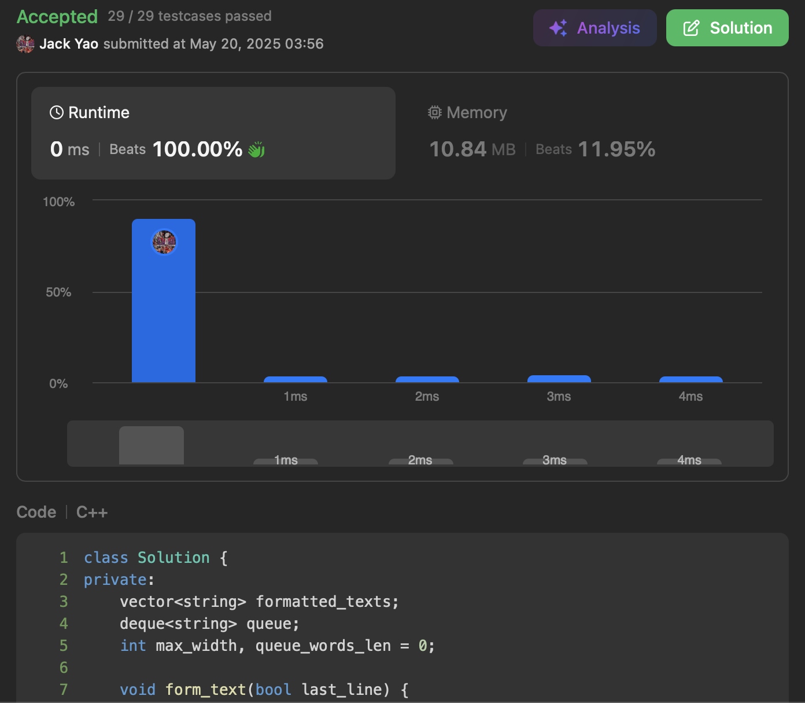

import Tabs from '@theme/Tabs';
import TabItem from '@theme/TabItem';
import CodeBlock from '@theme/CodeBlock';
import CppCode from './text_justificator.cpp?raw';
import PyCode from './text_justificator.py?raw';


## [Text Justification](https://leetcode.com/problems/text-justification/description/)
对Queue有初步体验的好题目

给定一堆字 要求尽可能把本来相邻的字放在同一句

但是每句的长度非得刚好凑到```maxWidth```

然后每句中的 __字之间必须有空格__

具体空格要放多少 取决于场景


## 先进先出
首先安排个队列 装那些 __正在集结一起成句__ 的字

由于相邻两字之间起码有个空格 因此队列中这些字

会形成的句子长度 起码是 __$L = len(queue) - 1 + \Sigma_i \; len(word_i)$__

### 可能性1：长度超标
一旦目前迭代到的字$word_j$ 造成了

__$L + 1 + len(word_j) > $```maxWidth```__

那么这就是队列已经要全数成句子的时机

它们成句子后 自然清空队列 让$word_j$进队列 打响下一句的第一炮

### 可能性2：空间还够
否则的话 就是单纯$word_j$进队列 句子尚未非得成形 还能再等


## 确定要成形的句子
前面有说 句子成形时 相邻俩字中间空格怎么填 要看场景

题目的规定是两种不同风格的填空机制

### 1. Left Justification
如果成形的句子是最后一句 那么就要左对齐

也就是说 __相邻俩字中间刚好塞一个空格__

要是填完发现长度还没摸到```maxWidth```

直接在句子末尾补空格灌水啰

由此可见 不是最后一句的句子 __倘若仅带著一个字__

那这时该句的空格操作 __事实上自动变为左对齐__

### 2. Right Justification
__不是最后一句且夹带起码两字__ 的句子采取右对齐

先看有$len(queue) - 1$这么多个字与字之间缝隙

总共得填充$S = $```maxWidth``` $ - \Sigma_i \; len(word_i)$这么多空格

于是每个缝隙先各自填

__$\lfloor S // (len(queue) - 1) \rfloor$这么多空格__

当然通常馀数$M = S \bmod{(len(queue) - 1)}$是大于零的

换言之还要安排最后这$M$个空格 才能凑齐句长```maxWidth```

这也非常简单 __抓最左边的$M$个缝隙__

叫它们来各自额外多收个空格即可

左右对齐都掌握好了 此题自然到手

<Tabs>
  <TabItem value="cpp" label="C++" default>
    <CodeBlock language="cpp">{CppCode}</CodeBlock>
  </TabItem>

  <TabItem value="python" label="Python">
    <CodeBlock language="python">{PyCode}</CodeBlock>
  </TabItem>
</Tabs>


时间和空间复杂度都是$O(n)$
