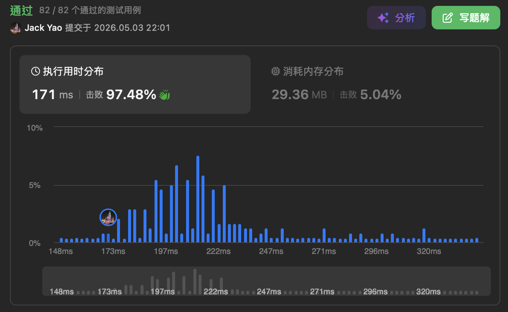

import Tabs from '@theme/Tabs';
import TabItem from '@theme/TabItem';
import CodeBlock from '@theme/CodeBlock';
import CppCode from './max_robots.cpp?raw';
import PyCode from './max_robots.py?raw';


## [Maximum Number of Robots Within Budget](https://leetcode.com/problems/maximum-number-of-robots-within-budget/description/)
__通过率38%徘徊__ 的第2398号难题 事实上只是想知道答题人懂不懂得一个基本意识：__审题__

一旦有好好审题 才会确信 __单调队列、滑动窗口、前缀和__ 三宝能合而为一拿下


## 永远只带著自然数的chargeTimes和runningCosts
输入有两项阵列：```chargeTimes```和```runningCosts``` 双方长度皆为n

第$i$索引上分别是第$i$台机器人充电时间和运行成本

每一个机器人的充电时间和运行成本都是 __自然数__ 本来嘛 成本若是负数

岂不是材料商把原物料『倒贴』给工厂？这样做出来的机器人还靠谱？😏

同理 充电时间要是有负数 那世界崩塌了是吧？

输入的第三项 是另一个正整数```budget```代表预算 而选中数量为k的机器人来运行有公式：

总开销 = $k$个机器人中最大的充电时间 + $k$ * 全部k个机器人们运行成本总和

因此题目问的是 在总开销不超过预算的前提下 最多能 __连续__ 抓多少台机器人同时运行

注意有 __连续__ 这个形容词 __它不接受同时抓第$i$台和第$i + 2$台 但不抓第$i + 1$台的跳跳虎模式__

看到这儿 我们就会察觉一个巧妙的事实：若$0 \leq i \leq j \leq l < n$

一旦连抓第$i$到第$j$台机器人时 发现这$j + 1 - i$台机器人的总开销超过预算

那我们抓第$i$到第$l$台机器人时 __一样会看见这$l + 1 - i$台机器人总开销超过预算 甚至更严重__

为什么呢？ 第$i$到$j$台机器人中最大的充电时间 $\leq$ 第$i$到$l$台机器人中最大的充电时间 __前者是后者的子集__

公式中的『$k$个机器人中最大的充电时间』没法下降

又刚才说过运行成本都是自然数 __因此第$i$到$l$台机器人运行成本总和 > 第$i$到$j$台机器人运行成本总和__

$k$随著机器人越抓越多只会上涨 既然三个子项都不可能下降 那总开销就不可能下降了

于是有个结论：一旦遍历时第$i$到$j$台机器人总开销超预算 __非得放弃第$i$台机器人__ 才有机会压回预算内

如此而言 是不是就有 __单调性__ 可言呢？ __失效的不会复活 继续往下遍历即可 无需回头再扫描__

听著就是时间复杂度O(n)解有望 __不过肯定还是要用恰当的数据结构 才能让单调性确实兑现成O(n)__


## 数据结构三宝
### 1. 滑动窗口：定好搜查范围
看到这我们确定了 遍历所有机器人的充电时间和运行成本时 __需要开两个指针：```startIdx```和```endIdx```__

反映的是当前抓了第```startIdx```到```endIdx```台 总计```endIdx``` + 1 - ```startIdx```这么多机器人在测算

__一旦总开销超标 就必须递增```startIdx``` 直到总开销回到预算内 或者```startIdx``` > ```endIdx```为止__

### 2. 单调队列：窗口内的最大充电时间
递增```endIdx```时 需要知道第```startIdx```到第```endIdx```这帮机器人中最大的充电时间是多少

那我们可用 __单调递减队列__ 来追踪最大值 先让第```endIdx```台机器人的充电时间和队列尾比较

只要队列尾的充电时间 $\leq$ 第```endIdx```台机器人的充电时间 队列尾自然失去作用 弹走就对啰

直到队列整个被弹光了 或者是第```endIdx```台机器人的充电时间 < 队列尾的充电时间 才停止比较

__同时我们还得在```startIdx```上升时 检查队首的索引是否摔出窗外了 是的话就弹走队列之首__

其馀队列内的成员自然往前一顺位 更新窗口内的最大充电时间

### 3. 前缀和：窗口内的运行成本总和
最后还差一个```windowTotalCost```变量 记录第```startIdx```到第```endIdx```台机器人运行成本的总和

递增```endIdx```时 把第```endIdx```台机器人的运行成本 __加到```windowTotalCost```上__

同理 递增```startIdx```时 把第```startIdx```台机器人的运行成本 __从```windowTotalCost```上减掉__

这样便能每次都拥有正确的窗口内运行成本总和 由此可见遍历```endIdx```过程中

一旦```startIdx```不再上升 那么窗口内的机器人自然不会产生超预算的总开销

这群机器人总数便是 __```endIdx``` + 1 - ```startIdx```__ 如此多啰 (1)

在滑动窗口的设计时 我们有说是可能发生```startIdx``` __不停递增 直到```startIdx``` > ```endIdx```__

因此对于每个```endIdx```来说 ```startIdx```最大是可能到```endIdx``` + 1的 __但这完全不用怕 因为__

__(1)中的机器人总数算式 会让此刻```endIdx``` + 1 - ```startIdx``` = 0 也就是不抓任何机器人了 这是合法的情况__

于是剩下的就是比较目前得出的机器人总数 有无胜过历史最大值 最后返回历史最大值即结案啰～～


__真的就是好好看清题目的Constraints 联想到在如此限制下 哪些数据结构能最快地保证正确性 时空复杂度双双O(n)__

<Tabs>
  <TabItem value="cpp" label="C++">
    <CodeBlock language="cpp">{CppCode}</CodeBlock>
  </TabItem>

  <TabItem value="python" label="Python" default>
    <CodeBlock language="python">{PyCode}</CodeBlock>
  </TabItem>
</Tabs>


## 延伸问题
回过头看 题目那句必须 __连续取机器人__ 的叙述 各位还觉得是条罗嗦限制吗🤓
