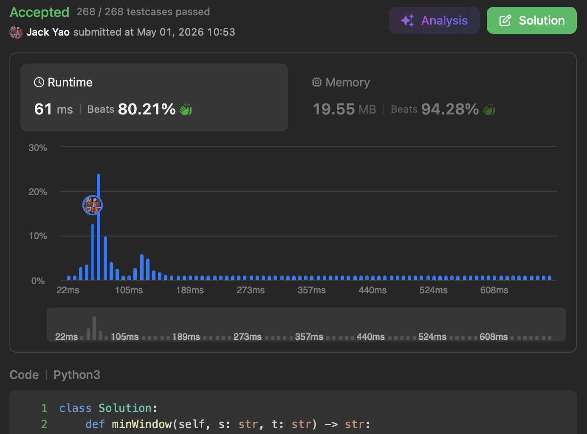

import Tabs from '@theme/Tabs';
import TabItem from '@theme/TabItem';
import CodeBlock from '@theme/CodeBlock';
import CppCode from './min_window_substring.cpp?raw';
import PyCode from './min_window_substring.py?raw';


### 滑动窗口的题目 基本有个共同特徵
一旦```left_idx```和```right_idx```达成某种条件时

我们先计算窗口长度```right_idx``` + 1 - ```left_idx```

和历史最大或最小窗口长度比较 更新历史纪录

有时甚至还得记载窗口的起始索引

然后把```left_idx```往右移动

直到不满足某种条件 或者```left_idx``` > ```right_idx```为止


### [Minimum Window Substring](https://leetcode.com/problems/minimum-window-substring/description/)
今天来拿第76号难题做示范

给了我们```source_str```和```target_str```俩字串

(其实题目里是叫```s```和```t``` 但```source_str```和```target_str```更有可读性)

要求在```source_str```中找到一个最短的子串

__这子串要包含```target_str```里所有出现的字符 重复的也要覆盖到__

找不到的话 就返回空字符串


### 老朋友哈希表🔢
得先统计下```target_str```里每个字符出现的次数

因为这是题目指定得 __包含重复情形 全数覆盖__ 的对象

这表就叫做```tgt_chars_counts```

同时我们先为接下来准备两变量：

1. ```min_len```：历史最短窗口长度 初始值为```len(source_str) + 1``` __象徵还没找到符合子串__
2. ```min_left_idx```：历史最短窗口的```left_idx``` 初始值为-1


### 就当做在买保险：少买不行 多买没关系
#### 一、```right_idx```总是在右移
开个整数变量```unique_tgt_chars_coverage```

追踪当前窗口 __覆盖多少种『Unique』的```target_str```字符__

每次我们把```right_idx```往右移动时

当下的```source_str[right_idx]``` 姑且叫做```char```

先看```char```是不是```tgt_chars_counts```的键

__唯有是 这```char```才是我们要覆盖的对象__

如果确实是 ```tgt_chars_counts[char]```减1

__象徵我们给这个```char```又买了一份保险__

要是```tgt_chars_counts[char]```给减到0了

__就说明```char```的覆盖要求彻底达成啦__

__于是在此刻__ ```unique_tgt_chars_coverage```加1

这边有个关键是 哪怕我们已达成对```char```的彻底覆盖

__只要又有遇到```char``` 那么```tgt_chars_counts[char]```仍要继续减1__

__掉到负数并没关系__ 因为这说明我们是 __超额覆盖__

超额覆盖是没有犯规的

没把```unique_tgt_chars_coverage```重复加1就好😏

__因此只有减到0那瞬间 才能升高覆盖计数__

#### 二、```left_idx```何时能右移
```unique_tgt_chars_coverage```一旦打平```len(tgt_chars_counts)```时

意味著咱们当前窗口完全覆盖```target_str```里所有的字符

赶快先计算当前窗口长度```window_len``` = ```right_idx``` + 1 - ```left_idx```

拿去和```min_len```比较 若成了历史新高

__还要连带用```left_idx```更新```min_window_left_idx```__

__毕竟最后我们要回去切```source_str```的子串作为答案__

记录检查更新弄好后 ```left_idx```就能往右移啰

因此会出现一个掉出窗口的字符

也就是```source_str[left_idx]``` 姑且叫做```removed_char```了

同样地 先看```removed_char```是不是```tgt_chars_counts```的键

__唯有是 这```removed_char```才是我们要覆盖的对象__

如果确实是 ```tgt_chars_counts[removed_char]```加1

__象徵我们给这个```removed_char```退掉了一份保险__

要是```tgt_chars_counts[removed_char]```变成大于0的瞬间

__就说明本来彻底覆盖的```removed_char```现在露馅咯__

于是此刻```unique_tgt_chars_coverage```必须减1

就像第一段的逻辑 哪怕```removed_char```已有露馅行为

__只要又有```removed_char```流失 ```tgt_chars_counts[removed_char]```仍要继续加1__

因为这说明我们是 __露馅越来越严重__

后面需要好好捕回来才能做到覆盖要求

只要没把```unique_tgt_chars_coverage```重复减1就好😏

__```tgt_chars_counts[removed_char]```从0变大于0那瞬间 才要调低覆盖计数__

最后等窗口全部扫描完毕 看```min_len```是否等于```len(source_str) + 1```

是的话 代表根本没找到符合条件的子串 必须回传""

否则就回传```source_str[min_window_left_idx: min_window_left_idx + min_len]```

<Tabs>
  <TabItem value="cpp" label="C++">
    <CodeBlock language="cpp">{CppCode}</CodeBlock>
  </TabItem>

  <TabItem value="python" label="Python" default>
    <CodeBlock language="python">{PyCode}</CodeBlock>
  </TabItem>
</Tabs>


时间复杂度：O(|source_str| + |target_str|)

空间复杂度：O(|target_str|)
