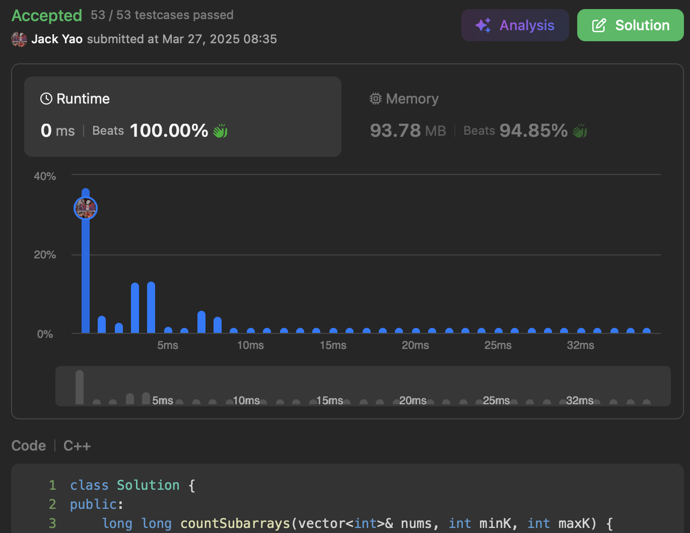

import Tabs from '@theme/Tabs';
import TabItem from '@theme/TabItem';
import CodeBlock from '@theme/CodeBlock';
import CppCode from './bounded_subarrays.cpp?raw';
import PyCode from './bounded_subarrays.py?raw';


## [Count Subarrays With Fixed Bounds](https://leetcode.com/problems/count-subarrays-with-fixed-bounds/description/)
又是一个有够适合掌握滑动窗口的好题


## 既然要minK和maxK两路Bounded
那我们每次挪动窗口右尾的```rightIdx```时

先检查一下是否$minK \leq nums[rightIdx] \leq maxK$

没做到的话 代表$nums[rightIdx]$摔出了既定范围

__由```rightIdx```做窗口右尾的合规子数组肯定不存在__

于是把窗口左端```leftIdx```改成```rightIdx``` + 1

同时```prevMinIdx```和```prevMaxIdx```都重置到-1

因为还不知道$nums[leftIdx:]$有没有刚好是$minK$或$maxK$的元素


## 只要$nums[leftIdx: rightIdx + 1]$没谁掉出界
那我们就看这扇窗口中

最近一次做到$nums[i] = minK$的索引$i$

把```prevMinIdx```赋予给$i$

最近一次做到$nums[j] = maxK$的索引$j$

把```prevMaxIdx```赋予给$j$

一旦```prevMinIdx```跟```prevMaxIdx```都不是-1

__就来到了我们窗口凑齐题目要求的瞬间__

本窗口能切的子数组有三个条件要遵守：

(1). 右尾在```rightIdx```

(2). 左端起码要有```leftIdx``` 且不超过右尾

(3). 左端再大也得在```min(prevMinIdx, prevMaxIdx)```封顶

(1)和(2)非常直观 重点在于(3)是怎么来的

__如果窗口内某个索引$k$符合```min(prevMinIdx, prevMaxIdx)``` $< k$__

__那么$nums[k:rightIdx + 1]$必然没法同时拥有$minK$和$maxK$__

题目要我们的子数组一起抓$minK$和$maxK$才行

于是当前窗口内 符合条件的子数组

__有$C = $ ```min(prevMinIdx, prevMaxIdx) + 1 - leftIdx```这么多__

把$C$加入最终要回传的```boundedSubarraysCount```更新

<Tabs>
  <TabItem value="cpp" label="C++" default>
    <CodeBlock language="cpp">{CppCode}</CodeBlock>
  </TabItem>

  <TabItem value="python" label="Python">
    <CodeBlock language="python">{PyCode}</CodeBlock>
  </TabItem>
</Tabs>


时间复杂度：$O(n)$ 其中$n$是输入的数组长度

空间则是$O(1)$ 仅需四根指针 和负责记录总值的```boundedSubarraysCount```
