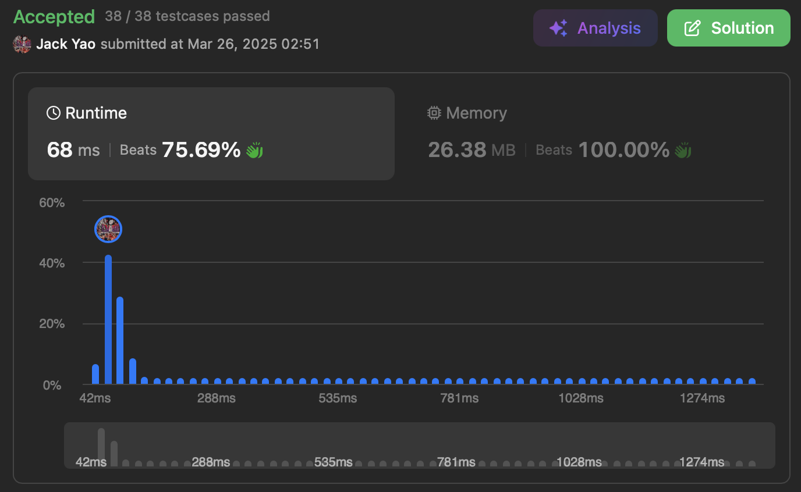

import Tabs from '@theme/Tabs';
import TabItem from '@theme/TabItem';
import CodeBlock from '@theme/CodeBlock';
import CppCode from './max_frequency_stack.cpp?raw';
import PyCode from './max_frequency_stack.py?raw';

## [Maximum Frequency Stack](https://leetcode.com/problems/maximum-frequency-stack/description/)
这种题的关键 通常都看`pop()`方法想干嘛

要我们移除且返回栈中频率最高的元素

__如果频率最高的元素有多个并列 选最接近栈顶的__

最接近栈顶的翻译：__最晚被纳入的__

因此需要对每个频率维持栈的结构

才好在Tiebreaker下 拿到最晚被纳入的元素

## 栈中栈
### 架构描绘
(1). __频率栈__：这是 __外层__ 结构 每当本来最高的频率

__其所含元素被清光 这个频率就不再是最高__

需要挪出栈 让栈顶留给下一个频率体现变化

(2). __元素栈__：这是 __内层__ 结构 每个频率有专属元素栈

同样频率下 __越晚升上来这频率的元素__ 越靠近栈顶

正是题目强调的Tiebreaker的体现

因此我们先开个`frequencyStack`的外栈

栈上每个索引$i$ 代表频率$i$

每个频率$i$上又内栈 储存频率为$i$的元素

### 方法实现
一、`push(int value)`：一旦被呼叫

先在哈希表给`value`的出场频率+1

假设更新后的频率来到了$x$

就在外栈上寻找索引为$x$的内栈

把`value`放到这个内栈最顶端

__因此如果发现$x$等于外栈长度时__

__说明目前外栈只反映到频率$x - 1$__

需要在外栈顶开个新内栈储存频率$x$

二、`pop()`：每次运作时 首先将外栈上

最顶部的内栈 弹出其栈顶元素

在哈希表把被弹元素的频率-1

__这便是频率最高的元素中最接近栈顶的__

接著检查外栈顶的内栈是否被清空

空掉的话 自然也请这个内栈弹离开外栈

精确反映目前最大频率的变化

<Tabs>
  <TabItem value="cpp" label="C++">
    <CodeBlock language="cpp">{CppCode}</CodeBlock>
  </TabItem>

  <TabItem value="python" label="Python" default>
    <CodeBlock language="python">{PyCode}</CodeBlock>
  </TabItem>
</Tabs>

时间复杂度在`push(int value)`和`pop()`都是$O(1)$ 空间则是有$O(n)$

可别像[Algo Monster](https://algo.monster/liteproblems/895)搞heaps弄成$O(logn)$时间复杂度欸
