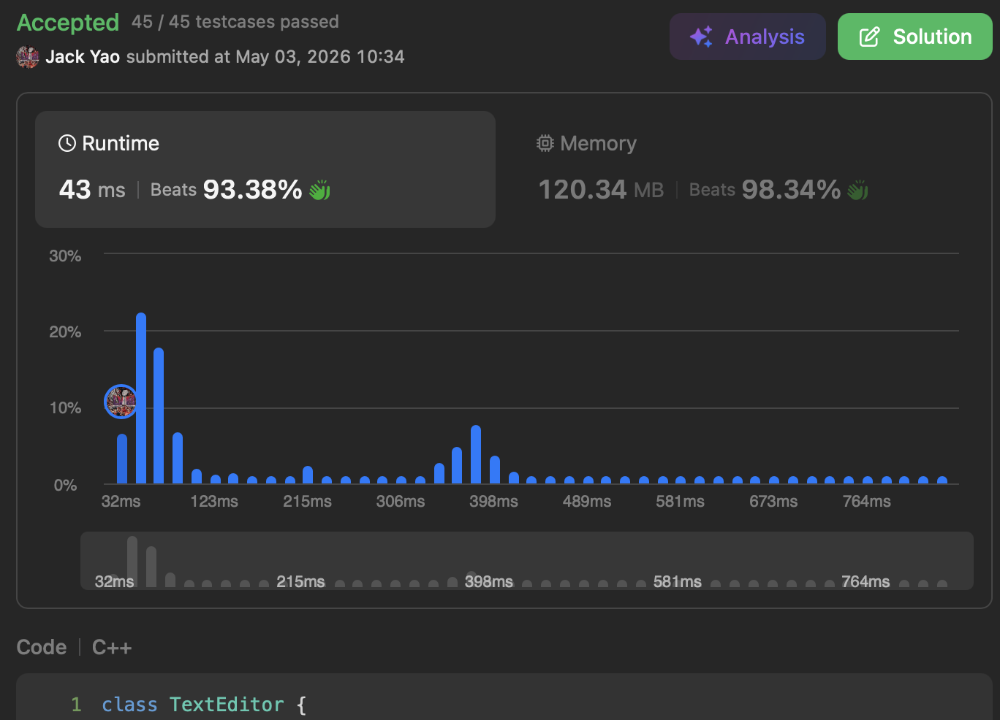

import Tabs from '@theme/Tabs';
import TabItem from '@theme/TabItem';
import CodeBlock from '@theme/CodeBlock';
import CppCode from './text_editor.cpp?raw';
import PyCode from './text_editor.py?raw';

## [Design a Text Editor](https://leetcode.com/problems/design-a-text-editor/description/)
此题就把 __Cursor看成楚河汉界__

Cursor左是红帅区 Cursor右是黑将区

双方 __分别是后段和前段__ 贴著Cursor 因此

Cursor __左边红帅区用LIFO的栈__

Cursor __右边黑将区用能头部安插和弹出的Deque__

这样Cursor无论往哪移 滑多少

都能轻松调度字符往来栈和Deque

## 要实现的方法们
### `addText(string text)`
整个`text`加入Cursor左边的栈

__时间复杂度：$O(|\text{text}|)$__

### `deleteText(int k)`
从Cursor左边的栈顶删除`min(k, len(stack))`个字符

最后要回传的实际删除次数 自然是`min(k, len(stack))`

__时间复杂度：$O(k)$__

### `cursorLeft(int k)`
Cursor往左移$k$个位置 就是楚河汉界往红帅区压缩

__Cursor左栈顶附近的字符 势必成为右Deque头附近的字符__

因此把Cursor左边栈顶的`min(k, len(stack))`个字符

依次弹出栈顶 __加入Cursor右边的Deque头__

弹好后 再到Cursor左的栈顶

从此往左数`min(10, len(stack))`个字符 切下子串传回去

__时间复杂度：$O(k)$__

### `cursorRight(int k)`
Cursor往右移$k$个位置 就是楚河汉界往黑将区压缩

__Cursor右Deque头附近的字符 势必成为左栈顶附近的字符__

因此把Cursor右边Deque头部的`min(k, len(Deque))`个字符

依次弹出Deque __加入Cursor左边的栈顶__

弹好后 再到Cursor左的栈顶

从此往左数`min(10, len(stack))`个字符 切下子串传回去

__时间复杂度：$O(k)$__

空间复杂度就是$O(n)$ $n$代表Cursor两边的字符总数 

<Tabs>
  <TabItem value="cpp" label="C++" default>
    <CodeBlock language="cpp">{CppCode}</CodeBlock>
  </TabItem>

  <TabItem value="python" label="Python">
    <CodeBlock language="python">{PyCode}</CodeBlock>
  </TabItem>
</Tabs>
