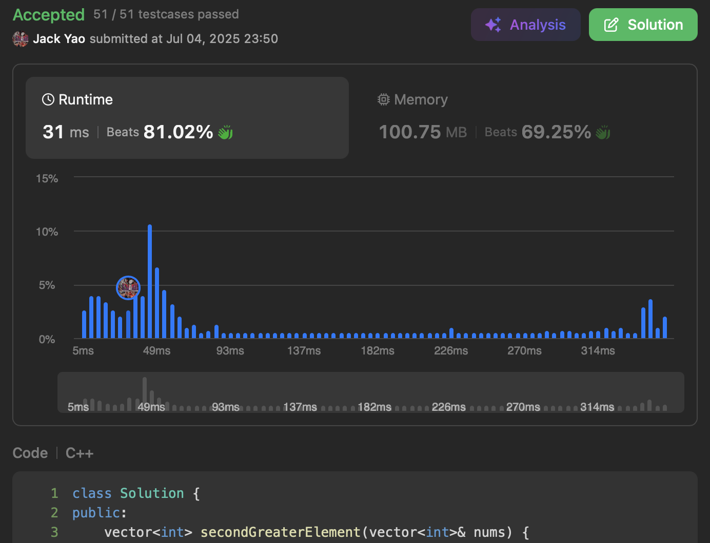

import Tabs from '@theme/Tabs';
import TabItem from '@theme/TabItem';
import CodeBlock from '@theme/CodeBlock';
import CppCode from './second_next_greater.cpp?raw';
import PyCode from './second_next_greater.py?raw';

### First Next Greater Element 简述
[Next Greater Element I](https://leetcode.com/problems/next-greater-element-i/description/)

[Geeks for Geeks讲解First Next Greater Element](https://www.geeksforgeeks.org/dsa/next-greater-element/)

相信大家都对First Next Greater Element耳熟能详

在LeetCode 这个First Next Greater Element问题是第496题 难度Easy

那么今天就来介绍第496号题的孪生兄弟：第2454道题 __难度Hard__

### [Next Greater Element IV](https://leetcode.com/problems/next-greater-element-iv/description/)
第2454号题名叫做Next Greater Element IV __其实更加贴切的称呼是 Second Next Greater Element__

要求我们对于每个元素$nums[i]$ 找到它右边的第二个比它大的元素 光是找到第一个比它大的元素并不够解套

### 热门网站咋整的2454号题呢
[Algo Monster](https://algo.monster/liteproblems/2454) 纯粹Binary Search解方

[LeetCode Wiki](https://github.com/doocs/leetcode/blob/main/solution/2400-2499/2454.Next%20Greater%20Element%20IV/README.md) 主轴是Ordered Set 开头需要总排序

遍历数组时玩二分查找或Ordered Set 都是的$O(nlogn)$解方 这俩网站的作法最后固然是AC了

但......我们还是能学前Stanford现任Columbia CS教授的Tim Roughgarden

他在YouTube和Coursera上开数据结构和算法课时 开头的那句名言：

[Roughgarden教授头是真会反光 但也超会教数据结构和演算法的](https://www.youtube.com/watch?v=yRM3sc57q0c&list=PLEAYkSg4uSQ37A6_NrUnTHEKp6EkAxTMa)

### 我如何看待"Second" Next Greater这句
先想想看一个底层问题：什么样的元素 __才值得 或者说 才有资格__ 去讨论『我的Second Next Greater在哪儿🥲』？

肯定是已经遇见首个比自己大的右边元素了😏 __此时正在寻觅下一个比自己大的右边元素__

__正在寻觅下一个比自己大的右边元素__？ 这个动作怎么有点眼熟？

还不曾看见过首个比自己大的右边元素的元素 不就是 __正在寻觅下一个比自己大的右边元素__？

因此我们能立马看出一个事实：若某个元素$x$最后找到Second Next Greater

$x$必然成功地找到了 __两次 的『下一个比自己大的右边元素』__ 这俩次的寻找 __动作一样 状态不同：__

1. 第一次搜索『下一个比自己大的右边元素』时 $x$的状态是：还未曾碰到过任何一个比自己大的右边元素
2. 第二次搜索『下一个比自己大的右边元素』时 $x$的状态是：已经碰到过刚好有一个比自己大的右边元素

第一件事既然众所周知能靠单调递减栈简单解决

第二件事那显然也能纯凭栈呀 __无需特地开二分查找或Ordered Set__

我们只要开一号栈给第一件事 二号栈给第二件事 分别管理处于不同状态的元素们即可

往后在遍历$nums$的过程中 请当前被轮值到的元素$y$先来检查二号栈

只要二号栈还有元素 且顶部元素小于$y$ 恭喜这顶部元素找到$y$做自己的Second Next Greater

把顶部元素从二号栈弹出 并记录它找到$y$作为答案

等到二号栈要嘛全空了 要嘛顶部元素不小于$y$了 就是$y$无法再成为谁的Second Next Greater的时候了

此刻 $y$的工作变成是来看看自己能做谁的First Next Greater了

同理 只要一号栈还有元素 且顶部元素小于$y$ 说明$y$是这顶部元素的First Next Greater

自然请这顶部元素离开一号栈 先去🚚上待著 等到一号栈要嘛全空了 要嘛其顶部元素不小于$y$了

$y$就结束了任务 能进入一号栈等待未来 刚才说的🚚同时可开往二号栈了 当然非常得注意一点就是

因为一号和二号栈均为单调递减 __因此上🚚的先后顺序是由小到大的__

🚚把本来属于一号栈的元素交接给二号栈的时候 __必须请大的先走入二号栈__ 小的殿后 维持二号栈的单调递减特性

由于每个元素都被遍历一次 刚好进过一号栈一遍 最多进入二号栈一遍 __因此双栈的时间复杂度是$O(n)$ 空间也是$O(n)$__

**😎这是我开C++写双栈方法的效能表现 Submit键按下去后 非常快就显示我想出的解答AC啰～～**

(小声说: Algo Monster和LeetCode Wiki给的解方 在C++耗费了350+ ms __把时间分布表往另一边拉大了__ 详见横轴嘻嘻)

### 心得小结：2 = 1 + 1
由此可见这道Second Next Greater Element的难题 __本质就是2 = 1 + 1这恒等式的体现__

__把问题想成是做两遍的First Next Greater Element__ 自然意识到双栈一起来做解方的

事实上 大厂招人时的 __Team Match 本质也是Second Next Greater Element的体现__

__数组不是无限长 一进二号栈 就拼每次遍历带来的升空机会 Team Match亦若是__

<Tabs>
  <TabItem value="cpp" label="C++" default>
    <CodeBlock language="cpp">{CppCode}</CodeBlock>
  </TabItem>

  <TabItem value="python" label="Python">
    <CodeBlock language="python">{PyCode}</CodeBlock>
  </TabItem>
</Tabs>

### 延伸问题
现在我们看过First和Second Next Greater的问题了，那么不妨想想看：
1. 若在长度为$n$的数组上 给每个元素找右边第$k$个比自己大的元素 __$k$是个正整数变量__ 那时间和空间复杂度各有多少😉
2. 承上个小问 __最差情况下的时间复杂度__ 和$k$有关系吗？若沒有关系 那又是为什么呢？此刻时间复杂度会是多少？
3. 续第1问 若我们有$n = 1000000$这么长的阵列 则下面哪种$k$值 最容易给所有元素出结果呢？
   (A) $k = 1$ (B) $k = 10^2$ (C) $k = 10^4$ (D) $k = 10^6$

三个小问题想明白 自然能掌握单调栈的哲学咯🤓
