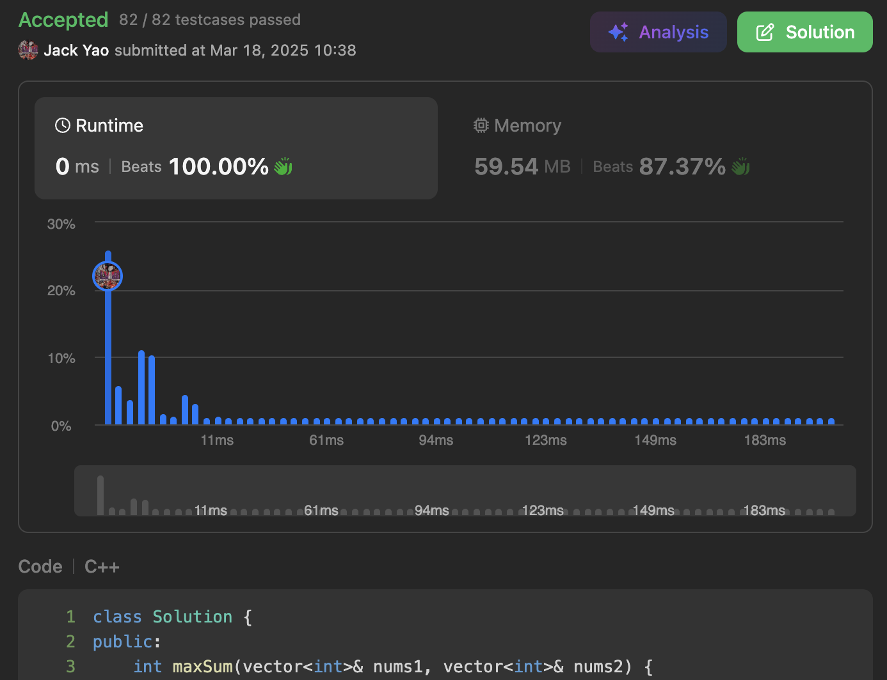

import Tabs from '@theme/Tabs';
import TabItem from '@theme/TabItem';
import CodeBlock from '@theme/CodeBlock';
import CppCode from './max_score.cpp?raw';
import PyCode from './max_score.py?raw';

## [Get the Maximum Score](https://leetcode.com/problems/get-the-maximum-score/description/)
磨练双指针题型的好地方

一切的关键就在题目说的 但凡两个排序好的数组

都享有某个数值时 我们就能把这个数值做 __交流道__

由此 __选择__ 把访问路径从某数组 __切换到__ 另一个数组

注意 这个选择不是必须齁 __只有在换了会更好时 才有理由换道__

## 🗝️🔒两小无猜的针锋相对
两个数组各自准备一根指针🪡

只要两根指针`idxOne`和`idxTwo`还没有越过自己所属数组的长度

且他们指向的数值不一致时 我们就不停让对应数值比较小的指针

持续向上递增 __直到该指针对位的数值 $\geq$ 另一根指针对位的数值__

指针向上递增前 __必须先把本来指向的数值 加给自己对应的分数__

## 👩🏻‍❤️‍💋‍👨🏻当情侣达成一致 不再互相拉扯
__一旦来到两个指针都指向相同数值的时候__

咱们就能进行比较 看看是`scoreOne`和`scoreTwo`比较大

把`max(scoreOne, scoreTwo) + nums[scoreTwo]`加入`maxScore`

为啥还要把`nums[scoreTwo]`加上去呢？别忘了

我们是 __在递增前那瞬间__ 才把指针对位的数值放入指针搭配的分数中

等到`maxScore`吸收完毕后 两根指针自然各自往上递增一格

`scoreOne`和`scoreTwo`因此清零重新开始

## 总会有人需要多留下来善后
好比Merge Sort的Merge阶段 肯定会有某个数组先被访问完

另一个数组还有数值没被访问完 我们这题也是一样的情形

必然有其中一个数组的指针 尚未扫过该数组全部的数值

因此得让该指针持续递增 将数值加进自己负责的分数

最后`scoreOne`和`scoreTwo`再取较大者 加到`maxScore`

然后答案便搞定啰 当然这题有个题目的老细节

就是由于数值叠加过程可能会超大 引起天文数字

因此需要$10^9 + 7$作为Modulo 控制`maxScore`大小再回传

整道算法就是两根指针变量 三种分数变量 一个Modulo常量

合计六个变数需要开 因此空间复杂度$O(1)$

时间复杂度非常显眼就是$O(\text{|nums1|} + \text{|nums2|})$ 因为每个数值只会被扫描一遍

<Tabs>
  <TabItem value="cpp" label="C++" default>
    <CodeBlock language="cpp">{CppCode}</CodeBlock>
  </TabItem>

  <TabItem value="python" label="Python">
    <CodeBlock language="python">{PyCode}</CodeBlock>
  </TabItem>
</Tabs>
