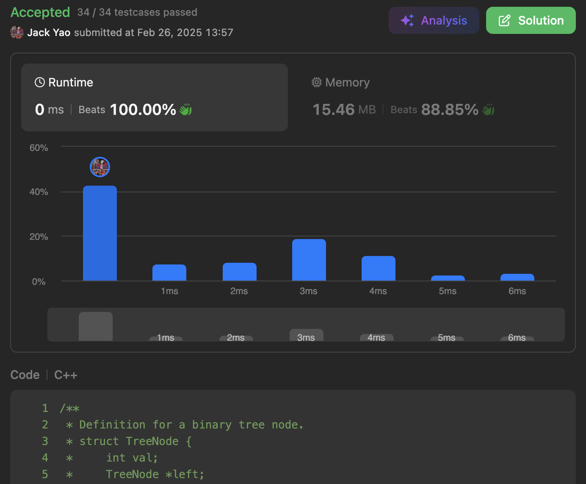

import Tabs from '@theme/Tabs';
import TabItem from '@theme/TabItem';
import CodeBlock from '@theme/CodeBlock';
import CppCode from '@site/docs/bfs/0987_hard/vertical_traversal.cpp?raw';
import PyCode from '@site/docs/bfs/0987_hard/vertical_traversal.py?raw';

## BFS Is Still Very Important
Although not used as frequently or famously as DFS, which is closely tied with recursion,

BFS still has its own dominance in level-order traversals on trees and graphs.

**Should never allow yourself to know only one of these two search algorithms.**

If you aren't familiar enough with BFS yet, **take a look at this GeeksforGeeks article first**:
https://www.geeksforgeeks.org/dsa/breadth-first-search-or-bfs-for-a-graph/

After understanding the basics of BFS, come back to solve Problem 987.

## [Vertical Order Traversal of a Binary Tree](https://leetcode.com/problems/vertical-order-traversal-of-a-binary-tree/description/)
Although this is a Hard problem, I would still say:

Problem 987 is an excellent warm-up for BFS. 😉😏

## Row & Column Coordinates of a Binary Tree
The problem states that if a parent node is located at $(x, y)$,

its left and right children are located at $(x + 1, y - 1)$ and $(x + 1, y + 1)$, respectively.

This is very straightforward:

- **Moving to left child means moving down-left**, so row increases by 1 while column decreases by 1.

- **Moving to right child means moving down-right**, so row also increases by 1, **but this time column increases by 1 as well.**

Naturally, root node starts at $(0, 0)$, since root stands **right in the middle**.

## Node Ordering Rule: Sort by Column First, Then by Value Within Same Column
### Track Each Column Separately
This is required by the problem itself and also follows naturally from properties of a binary tree.

**Whenever we move down one level, the tree may continue expanding toward the left.**

Whether it also expands toward the right depends on actual tree structure.

This makes BFS, which explores tree level by level, a suitable approach for this problem.

We first prepare an array called `columnsValues`.

From left to right, it stores an exclusive array for every column in binary tree.

**Each exclusive array stores all node values of that column in sorted order.**

### Key is Simply This
While performing BFS, we need to track:

**Which column does the leftmost array currently stored in `columnsValues` represent?**

**And which column does the rightmost array currently represent?**

Whenever BFS reaches a node whose column is further left than `leftmostCol`,

**`columnsValues` must insert an empty array at left front.**

This empty array stores node values of new leftmost column.

Conversely, if the node lies further right than `rightmostCol`,

**`columnsValues` must append an empty array to back right.**

This empty array stores node values of new rightmost column.

### Able to Expand in Both Directions
Now we know that `columnsValues` must support insertion at both left and right.

**The answer apparently becomes deque: a perfect foundation for `columnsValues`.**

### Locating Index in `columnsValues` After Expansion
Some of you may wonder:

**If `columnsValues` can expand toward left, how can we still locate correct position for a node using an index?**

Pause here for a moment and think about it before reading on. ~~

### Already Right Before Your Eyes
**That's right—`leftmostCol` is the key.**

Since `leftmostCol` stores column index represented by leftmost array in `columnsValues`, 

**subtracting `leftmostCol` from any current column value**

automatically gives correct index inside `columnsValues`. 🤓😎

### After Collecting All Columns and Nodes
Don't forget that node values inside each column still need to be sorted in ascending order.

Once every column has been sorted internally, simply return result,
since columns themselves have already been arranged from left to right.

<Tabs>
  <TabItem value="cpp" label="C++" default>
    <CodeBlock language="cpp">{CppCode}</CodeBlock>
  </TabItem>

  <TabItem value="python" label="Python">
    <CodeBlock language="python">{PyCode}</CodeBlock>
  </TabItem>
</Tabs>

Space complexity is $O(n)$, where $n$ is number of nodes in binary tree.

This naturally comes from FIFO queue used by BFS.

Time complexity is $O(n \log n)$ due to sorting.
