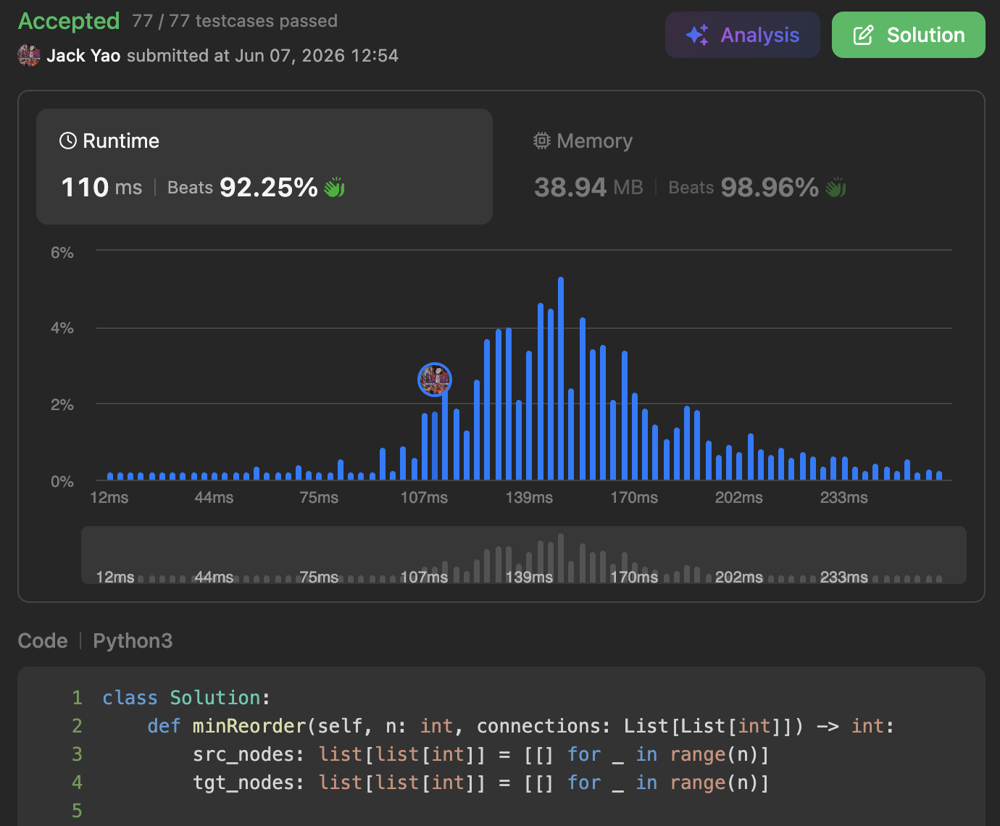

import Tabs from '@theme/Tabs';
import TabItem from '@theme/TabItem';
import CodeBlock from '@theme/CodeBlock';
import CppCode from '@site/docs/bfs/1466_medium/reordered_routes.cpp?raw';
import PyCode from '@site/docs/bfs/1466_medium/reordered_routes.py?raw';

## [Reorder Routes to Make All Paths Lead to the City Zero](https://leetcode.com/problems/reorder-routes-to-make-all-paths-lead-to-the-city-zero/description/)
Quite an interesting problem. It asks us in a directed graph:

what's the minimum number of directed edges to flip so that every city can reach city 0?

Given to us are $n$ cities and only $n - 1$ edges, __so there will be no cycles.__

## What Does a Graph Look Like If Every City Can Reach City 0?
It must be that when we start searching from city 0,

__all edges connected to city 0 point into city 0.__

City 0 has no outgoing edges at all. Then:

I. Suppose an incoming edge of city 0 comes from city $i$.

Then the only outgoing edge of city $i$ must lead to city $0$.

__As mentioned earlier, this graph contains $n$ nodes and $n - 1$ edges.__

__Thus, city 0 has no outgoing edges, while every other city has exactly one outgoing edge.__

II. Suppose an incoming edge of city $i$ comes from city $j$.

Then the only outgoing edge of city $j$ must lead to...yes: city $i$.

__The reason is the exact same as in Part I.__

III. Suppose an incoming edge of city $j$ comes from city $k$, so...

## Recursive Relationship of I, II, and III
I believe you have already noticed that I, II, and III are recursive.

__But this recursive relationship doesn't have to require DFS in this problem.__

__BFS can also handle this recursive relationship easily.__

Keep reading and you'll see why. 😁

## Temporarily Ignore Original Edges' Directions
We prepare a FIFO queue.

__Initially, queue contains only city 0, meaning that we start from city 0.__

As long as queue isn't empty, we:

remove city $i$ from queue's front and mark it as visited.

Then examine every edge connected to city $i$.

As long as city $j$, on the other end of this under-examination edge,

hasn't been visited, we push city $j$ into queue.

At the same time, we check direction of the edge between city $i$ and $j$.

__If this edge points from city $i$ to $j$,__

__it means this edge must be reversed, so we raise reversal count by one.__

<Tabs>
  <TabItem value="cpp" label="C++">
    <CodeBlock language="cpp">{CppCode}</CodeBlock>
  </TabItem>

  <TabItem value="python" label="Python" default>
    <CodeBlock language="python">{PyCode}</CodeBlock>
  </TabItem>
</Tabs>

Every node is visited exactly once, and we also need to track whether each node has been visited.

Both time and space complexity are $O(n)$.
