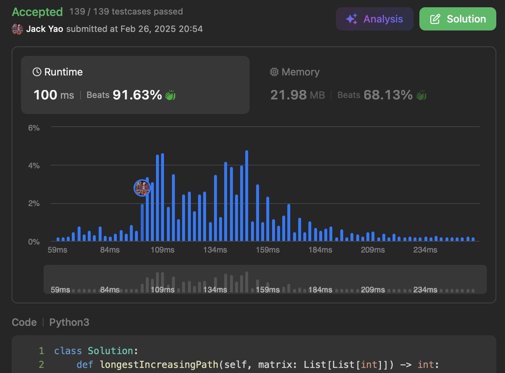

import Tabs from '@theme/Tabs';
import TabItem from '@theme/TabItem';
import CodeBlock from '@theme/CodeBlock';
import CppCode from '@site/docs/dfs/0329_hard/max_rising_path.cpp?raw';
import PyCode from '@site/docs/dfs/0329_hard/max_rising_path.py?raw';


## [Longest Increasing Path in a Matrix](https://leetcode.com/problems/longest-increasing-path-in-a-matrix/description/)
__A must-know matrix DFS pattern. Problem 329 is a classic example.__

Goal is to find the longest strictly increasing path in a matrix.

Constraint is that from any cell, when trying to extend a path,

only four cardinal directions (east, south, west, north) are allowed — __no diagonals__

Of course, stepping outside the matrix is also forbidden, so boundary checks come first.


## Scanning the Global Answer Effortlessly
For every element ```matrix[i][j]``` in the matrix,

we try using it as a starting point to find the longest increasing path from there.

So we create ```maxRisingPath```, a 2D array with the same dimensions as ```matrix```.

Initially, all elements of ```maxRisingPath``` are set to -1, __meaning unvisited__.

Then for each ```matrix[i][j]```, we check its four __potential__ neighbors:

1. ```matrix[i][j + 1]``` — east
2. ```matrix[i + 1][j]``` — south
3. ```matrix[i][j - 1]``` — west
4. ```matrix[i - 1][j]``` — north

When checking neighbor $x$, __once we confirm $x$ is within bounds__,

we then check whether __$x$'s value is strictly greater than ```matrix[i][j]```__.

If so, we look up __the longest increasing path starting from $x$__.

Adding 1 gives us __the longest increasing path from ```matrix[i][j]``` going through $x$__.

So if neighbor $x$ shows -1 in ```maxRisingPath```,

__it means $x$ hasn't been visited yet — we run DFS on $x$ first__.

Once $x$'s longest path length is determined, say $k$,

we apply: __$maxRisingPath[i][j] = max(maxRisingPath[i][j], 1 + k)$__

After updating ```maxRisingPath[i][j]```, __don't forget to compare it with global maximum__.


Both time and space complexity are $O(mn)$, where $m$ and $n$ are number of rows and columns.

Problem 329 is officially labeled hard, __but it's actually not that difficult — even relatively easy__.

A great problem to build fundamentals.

<Tabs>
  <TabItem value="cpp" label="C++">
    <CodeBlock language="cpp">{CppCode}</CodeBlock>
  </TabItem>

  <TabItem value="python" label="Python" default>
    <CodeBlock language="python">{PyCode}</CodeBlock>
  </TabItem>
</Tabs>
