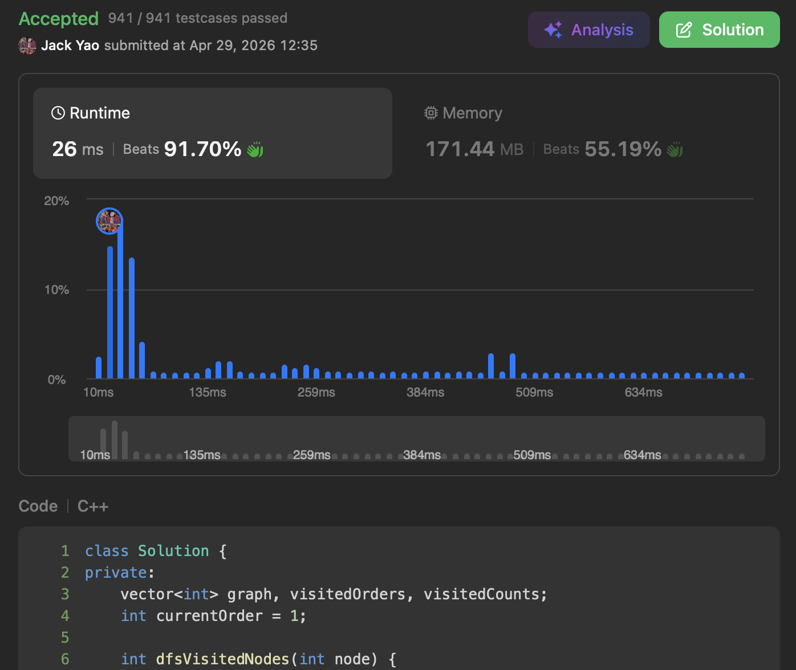

import Tabs from '@theme/Tabs';
import TabItem from '@theme/TabItem';
import CodeBlock from '@theme/CodeBlock';
import CppCode from '@site/docs/dfs/2876_hard/visited_nodes.cpp?raw';
import PyCode from '@site/docs/dfs/2876_hard/visited_nodes.py?raw';


## [Prerequisites](https://starsexpress.github.io/SkyHorse/docs/dfs/2360_hard/longest_cycle/)
__I'm not usually serious. But I am very serious this time.__

If you haven't fully grasped problem 2360 about the longest cycle detection,

jumping straight into problem 2876 might leave you __stuck in circles__ with no way out.


## [Count Visited Nodes in a Directed Graph](https://leetcode.com/problems/count-visited-nodes-in-a-directed-graph/description/)
A directed graph has $n$ nodes and $n$ edges, with nodes labeled $0$ to $n-1$.

All edge information is stored in an array called ```edges```,

where ```edges[i]``` is the label of the node to which node $i$'s outgoing edge points.

Also, $edges[i] \neq i$, meaning no self-loops exist.

__$0 \leq edges[i] \leq n - 1$__, so clearly every node has __exactly one outgoing edge__.

Our task is to compute, for every node,

__how many distinct nodes can be visited starting from that node and following edges__.


## Every Node Has Just An Outgoing Edge... So
You've probably already guessed it: by this constraint,

starting DFS from any node inside a cycle $C$ will only loop within $C$: no way to escape.

__Since every cycle member's sole outgoing edge points to another cycle member__,

if cycle $C$ has $k$ members, then from any of those $k$ nodes,

__you can only reach these $k$ members within this cycle 📲__

So once a cycle is identified ♻️, the answer to this entire cycle can be resolved at once ☑️.


## What About Non-Cycle Nodes?
Obviously, starting from any non-cycle node, you can visit yourself,

plus all the nodes reachable through your child.

__Because a parent's only outgoing edge goes to the child__,

__and the child's only outgoing edge goes to the grandchild, instead of coming back to its parent__.


## The Last Hurdle: Knowing Cycle's Boundary
At this point, we naturally realize from the discussion above

that cycle nodes and non-cycle nodes have different counting logic.

Now comes the tricky part: find a clean way to

__easily tell apart the boundary between cycle and non-cycle nodes__.

My approach: when a child finishes DFS and returns to its parent,

__it passes back an integer as a hint__.

This integer has two cases:

I. __-1: child is not a cycle member.__

So the parent is definitely not a cycle member either.

II. __A positive integer: child is a cycle member.__

What does this integer represent?

__Visit order $d[s]$ of the cycle's starting node__.

With this, the parent can use its own visit order

to determine whether it also belongs to the same cycle as its child:

(1). If the parent's visit order __$\geq d[s]$__,

__the parent is also a cycle member__, so it should __pass $d[s]$ upward__

__to let its grandparent also check cycle membership__.

(2). If the parent's visit order __$< d[s]$__,

then the parent __is not a cycle member__.

__This parent is the boundary__ between inside and outside the cycle.

So the parent must __pass -1 upward__,

__telling all layers above that it is not part of cycle__.


## Don't Forget to Pop Off the Stack
Just like in problem 2360, when a node finishes DFS and is about to return,

__its visit order must be set to -2, marking it as truly off the recursion stack__.

__The logic to detect when a cycle forms is identical to problem 2360__.


Each node and each edge is traversed exactly once. Time complexity is $O(V + E)$.

Space complexity is also linear: $O(V + E)$.

<Tabs>
  <TabItem value="cpp" label="C++" default>
    <CodeBlock language="cpp">{CppCode}</CodeBlock>
  </TabItem>

  <TabItem value="python" label="Python">
    <CodeBlock language="python">{PyCode}</CodeBlock>
  </TabItem>
</Tabs>
