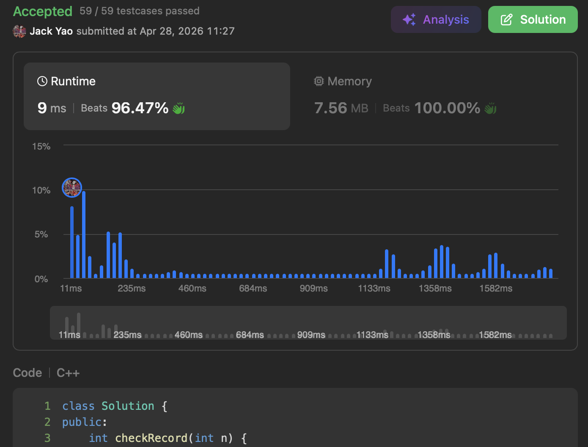

import Tabs from '@theme/Tabs';
import TabItem from '@theme/TabItem';
import CodeBlock from '@theme/CodeBlock';
import CppCode from '@site/docs/dp_tabulation/0552_hard/student_attendance.cpp?raw';
import PyCode from '@site/docs/dp_tabulation/0552_hard/student_attendance.py?raw';


## [Student Attendance Record II](https://leetcode.com/problems/student-attendance-record-ii/description/)
A great exercise to practice __bottom up style DP__.

At its core, this problem is about __how to legally "chain" records according to rules 🐲__.


## Read the Rules Carefully
Each student's daily attendance has three possible values:

"A" for Absent, "L" for Late, "P" for Present.

Here's the key: to earn attendance award, a student __must satisfy both__ conditions:
1. Count of "A" is __strictly less than__ 2
2. There must be __no__ 3 consecutive "L"s

The problem asks: given a positive integer $n$ representing the length of an attendance record,

how many valid attendance sequences allow a student to earn award?


## What the Rules Tell Us
I. "A" count __strictly less than__ 2 means "A" can never appear or just once.

Our counting logic must first split on "whether an A has occurred",
__because once an "A" appears, even if all subsequent days are "P", that "A" can't be erased__.

It's a bit like how a single act of infidelity leaves a permanent mark: never goes away.

II. The constraint of __no 3 consecutive "L"s__ means
whether today can be "L" __depends on if previous two days were already back-to-back "L"s__.

Only if there was no consecutive "LL" can today be an "L".


## You've Probably Spotted the DP Transitions 🍷
### 1. "Never Had an A" State
The most straightforward once. Sequences that already have an "A"
can never transition into "never had an A" state,
because as noted, once absent, __"A" sticks to the record forever__.

So transitions for "no A yet" state are:

__I. Count of length-$i$ sequences with no "A" yet, while ending in "P"__

comes from all valid length of $(i - 1)$ sequences with no "A":

__${}^{(0)} C_i^\text{P} = {}^{(0)} C_{i - 1}^\text{P} + {}^{(0)} C_{i - 1}^\text{L} + {}^{(0)} C_{i - 1}^\text{LL}$__

${}^{(0)}$ means no "A" has occurred yet.

Superscripts P, L, LL indicate sequence tail.

The subscript indicates the attendance on day $i$.

As long as no "A" has occurred, any valid ending from the previous day ("P", "L", or "LL")

__can transition into today's "P"__.

Note: __"L" and "LL" are different__. "L" means the previous day was "L",

__but the day before that wasn't "L"__. "LL" means both of last two days were "L".

__II. Count of length of $i$ sequences with no "A" yet, while ending in "L"__

comes from length of $(i - 1)$ sequences with no "A", while ending in "P":

__${}^{(0)} C_i^\text{L} = {}^{(0)} C_{i - 1}^\text{P}$__

If yesterday ended in "L" and today is also "L", that becomes __"LL"__, not "L".

__III. Count of length of $i$ sequences with no "A" yet, while ending in "LL"__

comes from length of $(i - 1)$ sequences with no "A", while ending in "L":

__${}^{(0)} C_i^\text{LL} = {}^{(0)} C_{i - 1}^\text{L}$__

An "LL" tail at the end of today means today is "L" and yesterday was also "L".

### 2. "Has Had an A" State
Pay closer attention here. The "has had an A" state
__can receive transitions from the "never had an A" state__.

So our following four transitions require careful handling:

__IV. Count of length of $i$ sequences with one "A", while ending in "P"__

comes from all valid length of $(i - 1)$ sequences that already have one "A":

__${}^{(1)} C_i^\text{P} = {}^{(1)} C_{i - 1}^\text{P} + {}^{(1)} C_{i - 1}^\text{L} + {}^{(1)} C_{i - 1}^\text{LL} + {}^{(1)} C_{i - 1}^\text{A}$__

${}^{(1)}$ means exactly one "A" has occurred.

All valid sequences with one "A" from the previous day can transition via today's "P".

__V. Count of length of $i$ sequences with one "A", while ending in "L"__

comes from length of $(i - 1)$ sequences with one "A", while ending in "P" or "A":

__${}^{(1)} C_i^\text{L} = {}^{(1)} C_{i - 1}^\text{P} + {}^{(1)} C_{i - 1}^\text{A}$__

If yesterday ended in "P" or "A", today being late gives us such a transition.

__VI. Count of length of $i$ sequences with one "A", while ending in "LL"__

comes from length $(i - 1)$ sequences with one "A", while ending in "L":

__${}^{(1)} C_i^\text{LL} = {}^{(1)} C_{i - 1}^\text{L}$__

Yesterday ended in "L", and today is late again.

__VII. Count of length of $i$ sequences with one "A", while ending in "A"__

This means the sequence had no "A" until today, as the student was absent today 😏

Such a transition comes from all valid length of $(i - 1)$ sequences with no "A":

__${}^{(1)} C_i^\text{A} = {}^{(0)} C_{i - 1}^\text{P} + {}^{(0)} C_{i - 1}^\text{L} + {}^{(0)} C_{i - 1}^\text{LL}$__

### 3. Where Are the Base Cases?
Naturally, __the case where only one day of attendance is counted__.

So base cases have only three possible endings: "A", "L", "P":

${}^{(0)} C_1^\text{P} = {}^{(0)} C_1^\text{L} = 1, \quad {}^{(0)} C_1^\text{LL} = 0$

${}^{(1)} C_1^\text{P} = {}^{(1)} C_1^\text{L} = {}^{(1)} C_1^\text{LL} = 0, \quad {}^{(1)} C_1^\text{A} = 1$

### 4. A Small Observation
After writing out all seven transition equations, careful readers will notice:

I. At the end of yesterday, all valid sequences with no "A" yet

__might get an "A" today via transition VII — all moving into the "one A, ending in A" state__,

__or stay as "no A" via transition I with today being "P"__.

II. Transitions III and VI are nearly identical.

__Only difference is the superscript indicating whether an "A" has occurred__.

III. Transitions II and V are quite similar as well.

__Difference is that V must also consider sequences ending in "A" from previous day__.

IV. Transitions IV and I are "full internal transfers".

In other words: if today is "P", you inherit all valid states from yesterday
__that carry the same number of "A"s as you do__. That's "internal".


## If Bottom Up Can Achieve $O(1)$ Space
[There's no need to use recursive caching and incur $O(n)$ space complexity.](https://algo.monster/liteproblems/552)

Pure bottom up also runs in $O(n)$ time complexity without any cache.

<Tabs>
  <TabItem value="cpp" label="C++" default>
    <CodeBlock language="cpp">{CppCode}</CodeBlock>
  </TabItem>

  <TabItem value="python" label="Python">
    <CodeBlock language="python">{PyCode}</CodeBlock>
  </TabItem>
</Tabs>

Since this problem doesn't involve absolute values, I use "abs" to represent "absence".

Remember to apply modulo periodically to prevent exploding large numbers.

Also, my variable ```recordLen```/```record_len``` is just LeetCode's parameter ```n```.


__Bottom up handles everything～～__


## Follow-up Problems
I. Intuitively, at the end of day 2, there shouldn't be any sequence
with tail "LL" that has also had one absence.

Yet transition VI's code looks like this:

```new_one_abs_table["ll"] = one_abs_table["l"]  # No.6: 1 absence end "l" => "ll".```

__Why don't we need if statement to check whether we're on day 2 — with all results still correct? 😌__

II. "LLL" disqualifies a student from the award. But "LLA",
which is arguably worse, somehow doesn't eliminate the student — quite funny the game design is 🤡

Here's a question: if we want "LLA" to also disqualify a student,
how should we modify transition equations?
