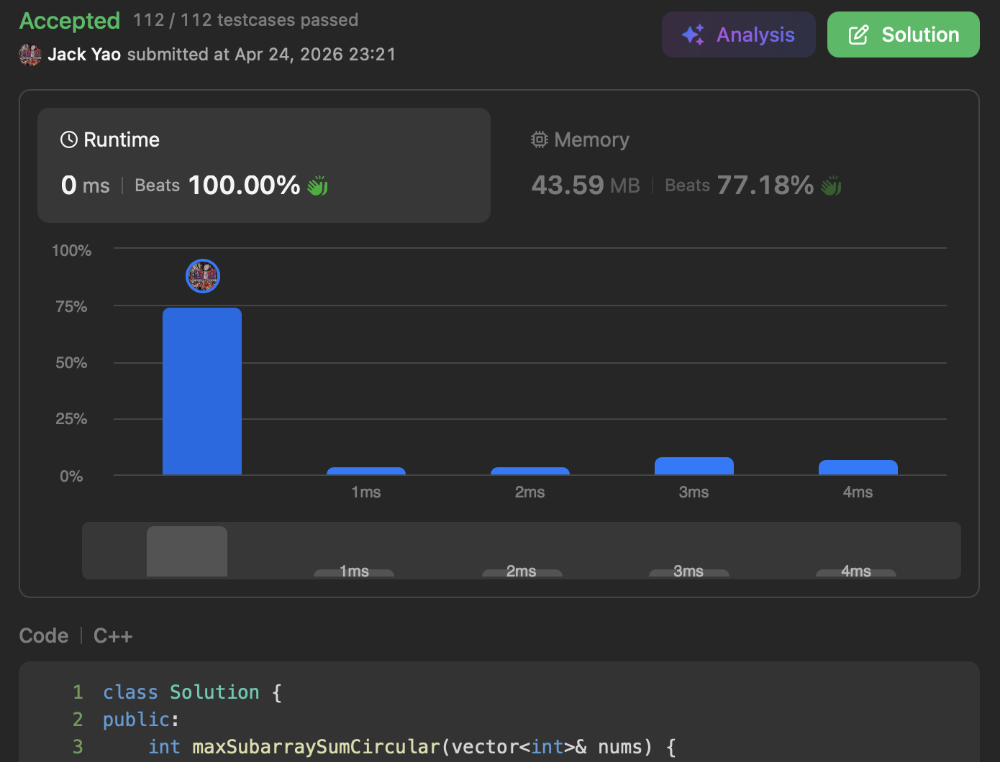

import Tabs from '@theme/Tabs';
import TabItem from '@theme/TabItem';
import CodeBlock from '@theme/CodeBlock';
import CppCode from '@site/docs/dp_tabulation/0918_medium/circular_subarray_sum.cpp?raw';
import PyCode from '@site/docs/dp_tabulation/0918_medium/circular_subarray_sum.py?raw';


## Quick Review
[Max Subarray Sum](https://leetcode.com/problems/maximum-subarray/)
👈 This is a classic bottom up DP problem.

It can be solved with Kadane's algorithm in $O(n)$ time and $O(1)$ space.

[GeeksforGeeks explanation of Kadane's algorithm](https://www.geeksforgeeks.org/dsa/largest-sum-contiguous-subarray/)

☝️ If you aren't yet familiar with Kadane's algorithm, read this article first.

Once you've got problem 53, come tackle this trickier problem 918.


## [Circular Subarray Sum](https://leetcode.com/problems/maximum-sum-circular-subarray/description/)
Problem 53 only allows us to find two indices $i$ and $j$ in an array $nums$ of length $n$,

satisfying $0 \leq i \leq j < n$, to maximize $\text{sum}(nums[i: j + 1])$.

Problem 918 accepts the same type of subarray as problem 53,

but it also accepts __circular subarrays__:

find two indices $i$ and $j$ satisfying $0 \leq i \leq j < n$,

__maximizing $\text{sum}(nums[:i] + nums[j:])$__

In short, this means taking __a prefix__ and __a suffix__ from $nums$,

with the constraint that __no indices can be used twice__.


## The Naive Wrong Path 🫨
To be honest, when I first solved problem 53,

I tried the "array concatenation" approach —

concatenating $nums$ into $nums + nums$ and applying problem 53's logic directly.

That ended with five wrong answers over two and a half months 🤣


## Time for Reverse Thinking 😌
Almost three months later, one day outside my home,

there was construction going on 🚧 with an excavator digging into the ground 🪏

__Watching the excavator scoop downward__, I suddenly realized that:

problem 918 requires __"excavation"__!

That is, find the subarray with the __most negative sum__ in $nums$,

__subtract it from $\text{sum}(nums)$__, and apply __"addition by subtraction"__ to eliminate this deficit —

what remains is the maximum circular subarray sum 😁

Kadane's algorithm in problem 53 finds the maximum subarray,

and here we need to find the __subarray with the minimum negative sum__,

so we just negate it: a reversal of thinking.


## The Excavator Can't Dig Recklessly
Just as construction must avoid hitting water pipes or power lines,

we must make sure we don't "dig out everything".

What do I mean? Consider the case where __all elements in $nums$ are non-positive__.

__The most negative subarray would simply be $\text{sum}(nums)$__,

and subtracting it from $\text{sum}(nums)$ leaves an empty subarray —

__an empty subarray is not allowed__.

How shall we fix things? __Simply track $max(nums)$__:

I. If $max(nums) \leq 0$, every element has no positive contribution.

__In this case, pick the element with the least poison — that's $max(nums)$__.

II. When $max(nums) > 0$, the answer is one of:
1. A standard maximum subarray as in problem 53.
2. A circular subarray: $\text{sum}(nums)$ minus the most negative subarray.

Take the larger of these two.

So we have some key variables to track:
1. ```maxPosSum```: maximum positive subarray sum
2. ```minNegSum```: minimum negative subarray sum
3. ```arrayTotalSum```: $\text{sum}(nums)$
4. ```maxNum```: $max(nums)$

The overall logic still follows problem 53's spirit.

<Tabs>
  <TabItem value="cpp" label="C++" default>
    <CodeBlock language="cpp">{CppCode}</CodeBlock>
  </TabItem>

  <TabItem value="python" label="Python">
    <CodeBlock language="python">{PyCode}</CodeBlock>
  </TabItem>
</Tabs>


A fresh perspective lets us solve this quirky problem in $O(n)$ time and $O(1)$ space.

Though sometimes it takes a long while before the right perspective finally arrives 😹
