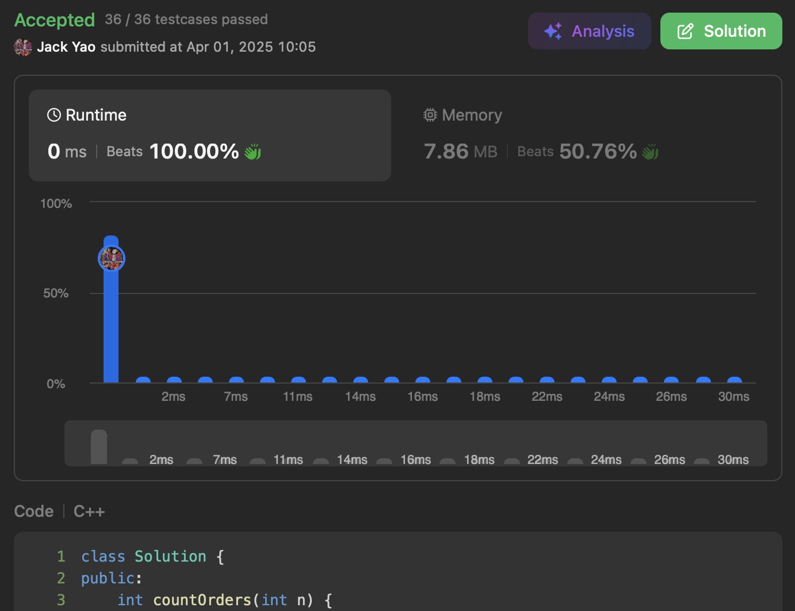

import Tabs from '@theme/Tabs';
import TabItem from '@theme/TabItem';
import CodeBlock from '@theme/CodeBlock';
import CppCode from '@site/docs/dp_tabulation/1359_hard/pickup_deliveries.cpp?raw';
import PyCode from '@site/docs/dp_tabulation/1359_hard/pickup_deliveries.py?raw';

## [Count All Valid Pickup and Delivery Options](https://leetcode.com/problems/count-all-valid-pickup-and-delivery-options/description/)
Another wonderful bottom up DP training.

A bit simpler than [problem 552](https://starsexpress.github.io/SkyHorse/docs/dp_tabulation/0552_hard/student_attendance). At least that's how I feel.

## Base Case
With only one order, there's only one valid arrangement:

pickup first (P), then delivery (D), giving a count of 1.

It looks like this: $(P_1, D_1)$.

## Observing the Path Upward 🧗
### 1. How to Place $P_2$ and $D_2$
__$P_i$ must always appear to the left of $D_i$. This is our problem's requirement.__

So let's first figure out where $P_2$ can go.

The sequence $(P_1, D_1)$ has 3 slots where $P_2$ can insert itself.

Once $P_2$ is placed, 4 slots are formed. However, __at $P_2$'s perspective__, they vary:

I. Place before $P_1$: __1 + 3__ format

Left side of $+$: slots to the __left of $P_2$__

Right side of $+$: slots to the __right of $P_2$__

II. Place between $P_1$ and $D_1$: __2 + 2__ format

III. Place after $D_1$: __3 + 1__ format

Since $P_i$ must always be to the left of $D_i$, once $P_2$ is placed,

__$D_2$ can only go into slots to the right__, which are those on the right of $+$.

Total valid slots for $D_2$: $1 + 2 + 3 = 6$.

So with 2 orders, our count is $1 \times 6 = 6$.

### 2. Generalizing to $P_j$ and $D_j$ for $2 \leq j$
When $P_j$ and $D_j$ are about to be inserted, there are already $j - 1$ orders in front,

__forming a sequence of length $2j - 2$__, from which $P_j$ thus has $2j - 1$ slots to choose.

From left to right, number of valid slots available to $D_j$ after placing $P_j$ __is $2j - 1, \ldots, 1$ respectively__.

This is an arithmetic series summing to $j(2j - 1)$,

which is exactly the __multiplier applied to previous count $C_{j-1}$__ when arranging $P_j$ and $D_j$.

Thereby, our state transition equation is:

$C_j = C_{j - 1} \times j(2j - 1) \quad \forall \; j \in \mathbb{N}; \; 2 \leq j$

Time to write the code 🧑🏻‍💻👩🏻‍💻

As always, numbers can get astronomically large. Don't forget to apply modulo.

<Tabs>
  <TabItem value="cpp" label="C++" default>
    <CodeBlock language="cpp">{CppCode}</CodeBlock>
  </TabItem>

  <TabItem value="python" label="Python">
    <CodeBlock language="python">{PyCode}</CodeBlock>
  </TabItem>
</Tabs>

$O(n)$ time, $O(1)$ space. __Be sure to practice writing the transition equation by hand too.__
