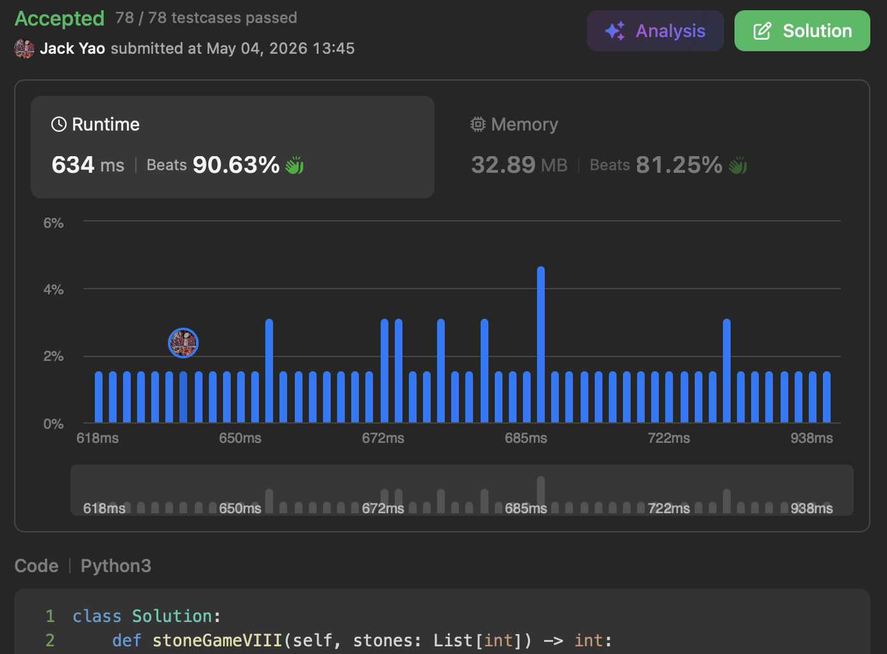

import Tabs from '@theme/Tabs';
import TabItem from '@theme/TabItem';
import CodeBlock from '@theme/CodeBlock';
import CppCode from '@site/docs/dp_tabulation/1872_hard/merge_stone_game.cpp?raw';
import PyCode from '@site/docs/dp_tabulation/1872_hard/merge_stone_game.py?raw';


## [Stone Game VIII](https://leetcode.com/problems/stone-game-viii/description/)
Problem 1872 is a DP problem that creates a particularly deep impression on me.

LeetCode's super popular Alice & Bob game.


## Alice Always Goes First
As LeetCode's tradition, Alice moves first just like __ladies first__.

So let's __put ourselves in Alice's shoes__ and think about her opening move.

The simplest first move is for Alice to merge all stones into one in 1 sweep,
bringing the game to an end with only one stone remaining.

Alice earns $\text{sum}(stones)$ points this way.

Bob, having no turn, scores 0 of course.

Alice's sweep gives a score difference of $D_{n - 1} = \text{sum}(stones)$,

where the subscript indicates this merge included __the $(n - 1)^{\text{th}}$ stone__.


## But What If There Are $\geq 3$ Stones?
### Other Options Arise
With $\geq 3$ stones, Alice has more than just that one-and-done sweep.

__She can also leave out some stones, letting Bob come up to merge and score__.

Suppose Alice chooses to merge only up to the $(n - 2)^{\text{th}}$ stone.

She earns __$\text{sum}(stones[:n - 1])$__ points.

Two stones remain on the table: the rightmost with value $stones[n - 1]$,

and the merged one Alice just created with value $\text{sum}(stones[:n - 1])$.

Now Bob must merge both (no passing allowed), earning:

$\text{sum}(stones[:n - 1]) + stones[n - 1] = \text{sum}(stones)$

The score difference is $D_{n - 2} = \text{sum}(stones[:n - 1]) - \text{sum}(stones)$.

Notably, __$D_{n - 2}$ can be rewritten using $D_{n - 1} = \text{sum}(stones)$__ as:

__$D_{n - 2} = \text{sum}(stones[:n - 1]) - D_{n - 1}$__

### Should Alice Switch Options?
Now we have a __binary choice: $D_{n - 2}$ vs. $D_{n - 1}$__.

(1). If $D_{n - 2} > D_{n - 1}$, Alice abandons that one-and-done merger,

and chooses to merge only up to $(n - 2)^{\text{th}}$ stone, leaving out $(n - 1)^{\text{th}}$.

Recall $D_{n - 2} = \text{sum}(stones[:n - 1]) - D_{n - 1}$

$D_{n - 2} > D_{n - 1}$ is equivalent to $\text{sum}(stones[:n - 1]) - D_{n - 1} > D_{n - 1}$

One conversation to describe: "To my dear opponent: I'll give you $D_{n - 1}$.

That's because I have an even stronger option $D_{n - 2}$ ~~ __so strong that even after your $D_{n - 1}$ offset,__
__my net differential still exceeds what I'd get if taking $D_{n - 1}$ directly.__"

(2). Conversely, if $D_{n - 2} \leq D_{n - 1}$, Alice merges everything.

From the same equation: $D_{n - 2} \leq D_{n - 1}$ means $\text{sum}(stones[:n - 1]) - D_{n - 1} \leq D_{n - 1}$

In translation: "Merging only up to $(n - 2)^{\text{th}}$ stone earns me $\text{sum}(stones[:n - 1])$,

but my opponent earns $D_{n - 1}$. After offsetting, my net lead is $\text{sum}(stones[:n - 1]) - D_{n - 1}$.

__Comparing these two, I find out it's better to also include $(n - 1)^{\text{th}}$ stone in my merger,__

__taking $D_{n - 1}$ as my net differential.__"

__Because of this reasoning, $D_{n - 2}$ must be assigned the value of $D_{n - 1}$__,

reflecting a key insight: __when only $(n - 2)^{\text{th}}$ and $(n - 1)^{\text{th}}$ stones remain unmerged__,

based on the score comparison, __merging both is better than leaving out $(n - 1)^{\text{th}}$ stone.__

__So the option to stop at $(n - 2)^{\text{th}}$ stone is eliminated__.
This elimination is due to our problem's own rule: __each player plays optimally__.

### Deriving the Transition from Here
By the same logic, if there's an option to merge only up to $(n - 3)^{\text{th}}$ stone:

$D_{n - 3} = \text{sum}(stones[:n - 2]) - D_{n - 2}$

This gives us a binary choice between $D_{n - 3}$ and $D_{n - 2}$.

You've probably spotted the pattern. The transition equation is:

__$D_{i} = \max(D_{i + 1}, \; \text{sum}(stones[:i + 1]) - D_{i + 1})$__

where the index range is $1 \leq i \leq n - 2$. Why this range?

(1). __Index 0 is excluded because the problem requires merging at least 2 stones each time.__

(2). Index $n - 1$ is also excluded because it's the __base case__:

merging all stones at once, covering up to the $(n - 1)^{\text{th}}$ stone.

__Base Case: $D_{n - 1} = \text{sum}(stones)$__

### Understanding the Transition
I once found a description that captures the stories behind quite well:

Given that when only stones $i + 1, \ldots, n - 1$ remain,
the current player will earn a net differential of $D_{i + 1}$.

If I merge only up to $i^{th}$ stone and earn $\text{sum}(stones[:i + 1])$,

can my earning still beat $D_{i + 1}$ after being offset?

I. If yes: __I'm willing to play a bigger game by seemingly making a sacrifice here.__

__Give up the known gain in exchange for an even greater upcoming gain__.

II. If no: __I can't let my opponent take that $D_{i + 1}$__.

__Better put it into my pocket now to be my net differential__.

You'll also notice our transition here is a bit unusual:

__it moves from larger indices to smaller indices__.

So when computing, __traverse from larger to smaller indices__,

[rather than using extra DFS and cache which would cost $O(n)$ space......](https://algo.monster/liteproblems/1872)

Also, the transition equation tells us
__each index's state only depends on the immediately previous index__,
[so there's no need to maintain an array costing $O(n)$ space.](https://walkccc.me/LeetCode/problems/1872/)

<Tabs>
  <TabItem value="cpp" label="C++">
    <CodeBlock language="cpp">{CppCode}</CodeBlock>
  </TabItem>

  <TabItem value="python" label="Python" default>
    <CodeBlock language="python">{PyCode}</CodeBlock>
  </TabItem>
</Tabs>

Just use a variable called ```max_score_diff``` to track $D_i$.



Time complexity $O(n)$, space complexity $O(1)$.


## Follow-up Problems
I. How would you modify the code above to print out all __"scoring plays"__?

A scoring play is defined as when any player merges some stones and earns points.

II. __To make the game more exciting, our goal is to maximize the number of scoring plays__.

What input array ```stones``` should you design to achieve this?
