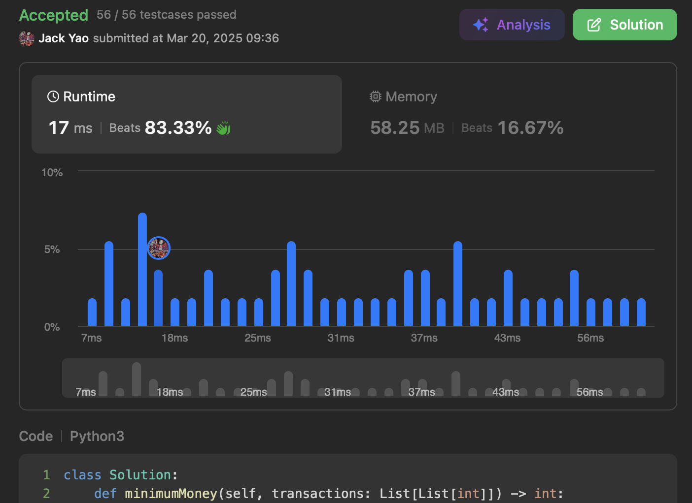

import Tabs from '@theme/Tabs';
import TabItem from '@theme/TabItem';
import CodeBlock from '@theme/CodeBlock';
import CppCode from '@site/docs/greedy/2412_hard/min_required_money.cpp?raw';
import PyCode from '@site/docs/greedy/2412_hard/min_required_money.py?raw';

## [Minimum Money Required Before Transactions](https://leetcode.com/problems/minimum-money-required-before-transactions/description/)
The reason this problem is labeled hard, I eventually noticed,
is that the key to solving it is actually a __reading comprehension test__.

## "Regardless of the order" of the transactions
We are asked to find the minimum amount of money such that

__no matter what order the transactions are executed__,
money will always be enough __for upcoming transactions at each time step__.

That is, this amount __guarantees we won't be unable to afford the next transaction__.

Let's think: in what situation is it most likely that

__after a transaction, our remaining money can't cover the next one?__

It must be... __a streak of losing transactions__,

steadily draining initial funds, bit by bit.

## The Protection at Absolute Security 🪖
From the above, we must at least withstand __total net loss of all losing transactions__.

We must __collect all transactions where $cashback_i < cost_i$__
and sum up their losses: $L = \Sigma_i (cost_i - cashback_i)$.

__Nevertheless, we also need to add the maximum cashback $x$ among all losing transactions__.

Why? __If we execute all losing transactions consecutively from the start__,

__and the last losing transaction__ happens to have cashback $x$,
the moment of maximum cumulated loss happens __right before receiving $x$ back__.

## But What About Profitable Transactions?
### A. If there are no profitable transactions
The minimum safe amount is simply __$L + x$__ as described above.

### B. If there are profitable transactions, be a bit more careful
__After losing transactions are done, we are still having profitable ones to handle__.

The nature of profitable transactions is that our principal never drops after each one.

So now we only need to consider one thing:

__after tortured by losing transactions, do we still have enough to cover entry cost of any profitable transaction?__

After all, profitable transactions __don't fall from the sky__:
__you have to pay cost first__ before getting cashback.

### How to Profit: 🌫️ Endure the Storm, See the Moon 🌕
By now, you've probably guessed we also need

__the number $L + y$, where $y$ is the maximum cost among all profitable transactions__.

The deeper meaning of such a number is:

__in the worst case, all losing transactions occur first__,
__immediately followed by the most expensive profitable transaction__.

We'd need to start with $L + y$ to handle everything.

Since subsequent profitable transactions cost no more than $y$,

and profitable transactions, by definition, never reduce our capital,

now it comes down to comparing __which is larger: $L + x$ or $L + y$__.

__The larger one is our final answer__.

<Tabs>
  <TabItem value="cpp" label="C++">
    <CodeBlock language="cpp">{CppCode}</CodeBlock>
  </TabItem>

  <TabItem value="python" label="Python" default>
    <CodeBlock language="python">{PyCode}</CodeBlock>
  </TabItem>
</Tabs>

Time complexity: $O(n)$, Space complexity: $O(1)$

Literally, this problem's core is understanding the phrase "Regardless of the order".
