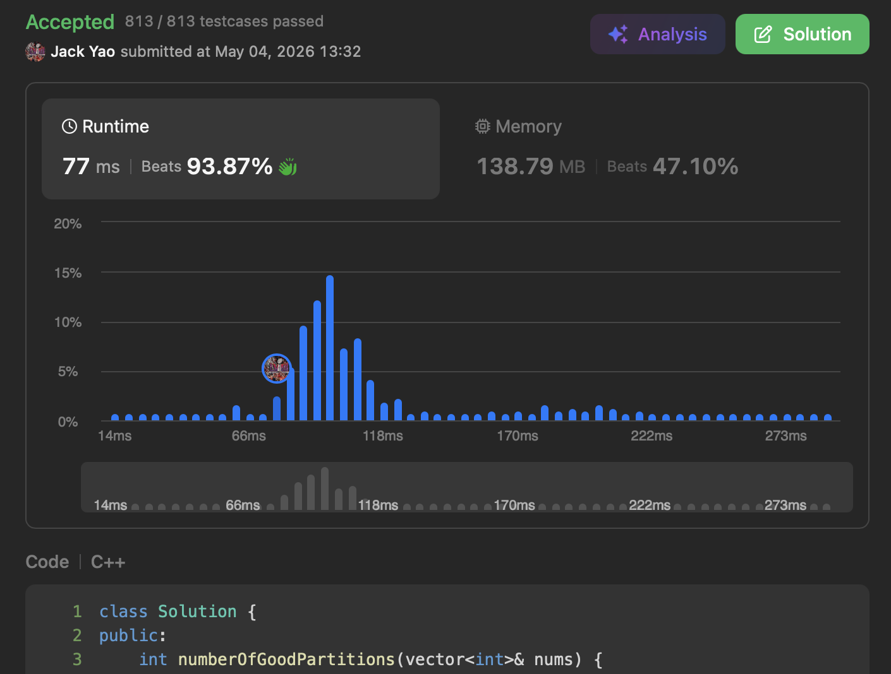

import Tabs from '@theme/Tabs';
import TabItem from '@theme/TabItem';
import CodeBlock from '@theme/CodeBlock';
import CppCode from '@site/docs/hash/2963_hard/good_partitions.cpp?raw';
import PyCode from '@site/docs/hash/2963_hard/good_partitions.py?raw';

## [Count the Number of Good Partitions](https://leetcode.com/problems/count-the-number-of-good-partitions/description/)
Straight to the point: this task is to __split the input array into one or more contiguous subarrays__,

with the constraint that __no two subarrays share the same number__. This is called a good partition.

The expected returned value is total number of good partitions.

## Can't Join Two Groups? So...
Put it this way: for any number, find its first and last occurrence at indices $i$ and $j$.

__Both $i$ and $j$ must belong to the same group__.

__Which means we need to track the last occurrence index of each number__.

With that in hand, we launch two pointers: `scanIdx` and `boundaryIdx`.

`boundaryIdx` represents __the right boundary index of the current unfinished group $G_k$__.

`scanIdx` is used to __incrementally scan__ indices within $G_k$ __that haven't been checked yet__.

What are we checking? __Whether the last occurrence index $j$ of the number $x$ at `scanIdx` exceeds `boundaryIdx`__.

If it does, we must update `boundaryIdx` = $j$,

__so that $x$ stays loyal and remains within the current unfinished group $G_k$, ensuring $x$ doesn't join two groups 😏__

Conversely, if during this incremental scan, `scanIdx` ever becomes __$>$ `boundaryIdx`__,

__it naturally means group $G_k$ has fully formed and stopped growing__,
so we update the total count of completed groups accordingly.

## What Does Group Count Represent?
Say there are $k$ groups in total, implying that there are $k - 1$ gaps between them.

Each gap faces two paths: __keep it to separate two adjacent groups, or remove it to merge them into one group__.

__The answer follows: total good partitions = $2^{k - 1}$ ✌️__

Since total number of partitions is on the order of __$O(2^k)$__, we use a modulo of $10^9 + 7$ to prevent overflow.

Even computing the exponent $2^{k - 1}$ should use __modular exponentiation__ for safety.

Hash map stores each number's last occurrence index. Space complexity $O(n)$.

__Modular exponentiation is implemented iteratively. Space complexity $O(1)$__.

Each index is scanned once by `scanIdx`, and once when building the hash map. Time complexity $O(n)$.

Modular exponentiation runs in $O(\log(k - 1))$, where $k$ is the total number of groups.

__Since $k$ is at most $n$, this is effectively $O(\log n)$__.

Overall time and space complexity: both $O(n)$.

<Tabs>
  <TabItem value="cpp" label="C++" default>
    <CodeBlock language="cpp">{CppCode}</CodeBlock>
  </TabItem>

  <TabItem value="python" label="Python">
    <CodeBlock language="python">{PyCode}</CodeBlock>
  </TabItem>
</Tabs>
