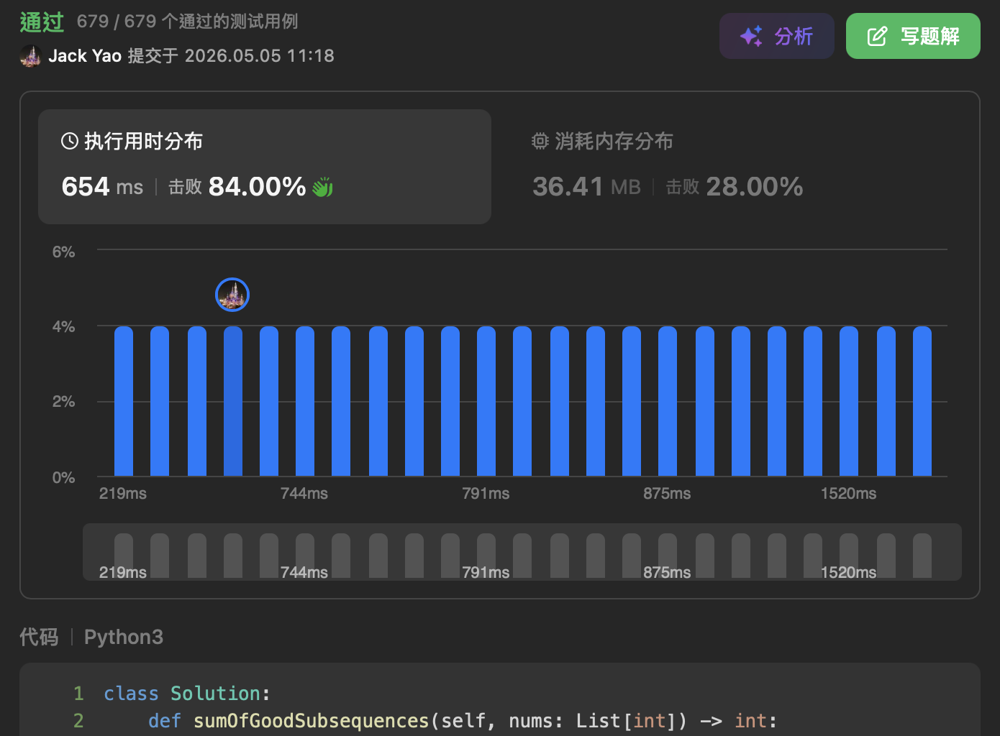

import Tabs from '@theme/Tabs';
import TabItem from '@theme/TabItem';
import CodeBlock from '@theme/CodeBlock';
import CppCode from '@site/docs/hash/3351_hard/good_subsequences_sum.cpp?raw';
import PyCode from '@site/docs/hash/3351_hard/good_subsequences_sum.py?raw';

## [Sum of Good Subsequences](https://leetcode.cn/problems/sum-of-good-subsequences/description/)
Counting and summing subsequences share a lot in spirit with doing the same for subarrays.

Before diving into problem 3351, let me briefly cover similarities and differences.

## Subarrays vs. Subsequences: Similar but Different
### A. Similar: Each Visited Element Tries to Be the "Tail"
When searching for subarrays, we let each visited index $i$ try to serve as subarray's tail,

asking how many subarrays end at index $i$.

__By the same logic__, we can let each visited index $i$ serve as subsequence's tail.

This keeps the loop logic clean and __avoids double-counting__.

### B. Different: How to Extend and Pass Down the Lineage
One of the main divergences. __Subarrays require strict index continuity__:

__index $i$ can only extend subarrays that end at index $i - 1$__.

__But subsequences allow skipping indices. Any relative order that's preserved is valid__:

__index $i$ can connect to any subsequence ending at indices $0, \ldots, i - 1$__.

## The Pattern in Problem 3351
For each currently visited index $i$, we look at how many

__subsequences with tail value $nums[i] - 1$ or $nums[i] + 1$ have appeared in the previous $i$ iterations__,

since the problem states that __adjacent elements__ in each subsequence must have an __absolute difference of exactly 1__.

Say among the previous $i$ iterations there are:

I. $j$ subsequences with tail value $nums[i] - 1$, with total sum $Sum_{nums[i] - 1}$

II. $k$ subsequences with tail value $nums[i] + 1$, with total sum $Sum_{nums[i] + 1}$

We can immediately conclude two facts:

1. The number of subsequences with tail __at index $i$__ is $j + k + 1$

2. The number of subsequences with tail __value of $nums[i]$ net increases__ by $j + k + 1$

Note that statements 1 and 2 use slightly different phrasing, because __there is only one index labeled $i$__,

but before visiting index $i$, __subsequences with tail value of $nums[i]$ may have already formed__.

Take a moment to digest the difference between these two statements before you read on~~

--------------No rush, take your time--------------

Back to $j + k + 1$. Where does $+ 1$ come from?

Don't forget: at index $i$, __we also have the right to start fresh__,

__letting $nums[i]$ form a subsequence on its own__.

With counting handled, summing follows naturally. We now have:

(1). Count of subsequences with __tail value of $nums[i]$ net increases__ by $j + k + 1$

(2). Total sum of subsequences with __tail value of $nums[i]$ net increases__ by

$(Sum_{nums[i] - 1} + nums[i] \times j) + (Sum_{nums[i] + 1} + nums[i] \times k) + (nums[i])$

This is a bit tricky. I've used three pairs of parentheses to explain each part 😄

a. First bracket: index $i$ __extends all subsequences with tail value of $nums[i] - 1$__.

Index $i$ inherits their total sum $Sum_{nums[i] - 1}$,

and $nums[i]$ is appended to all $j$ subsequences with tail value of $nums[i] - 1$.

b. Middle bracket: index $i$ __extends all subsequences with tail value of $nums[i] + 1$__.

Index $i$ inherits their total sum $Sum_{nums[i] + 1}$,

and $nums[i]$ is appended to all $k$ subsequences with tail value of $nums[i] + 1$.

c. Last bracket: index $i$ __lets $nums[i]$ form a standalone subsequence__.

So parts a, b, and c together give the __net increase in total sum for subsequences with tail value of $nums[i]$__.

After the full traversal, we sum up the total sums across __all distinct tail values__,

then apply modulo $10^9 + 7$ as required.

One thing to note: __the number of subsequences is on the order of $O(2^n)$__,

and throughout our pipeline, __we use subsequence counts to compute subsequence sums__,

so __we must apply modulo to both counts and sums during computation__ to prevent overflow.

Time and space complexity: both $O(n)$.

<Tabs>
  <TabItem value="cpp" label="C++">
    <CodeBlock language="cpp">{CppCode}</CodeBlock>
  </TabItem>

  <TabItem value="python" label="Python" default>
    <CodeBlock language="python">{PyCode}</CodeBlock>
  </TabItem>
</Tabs>

## Follow-up Problem
If the problem asked for subarrays instead of subsequences, how would the optimal time and space complexity change?
