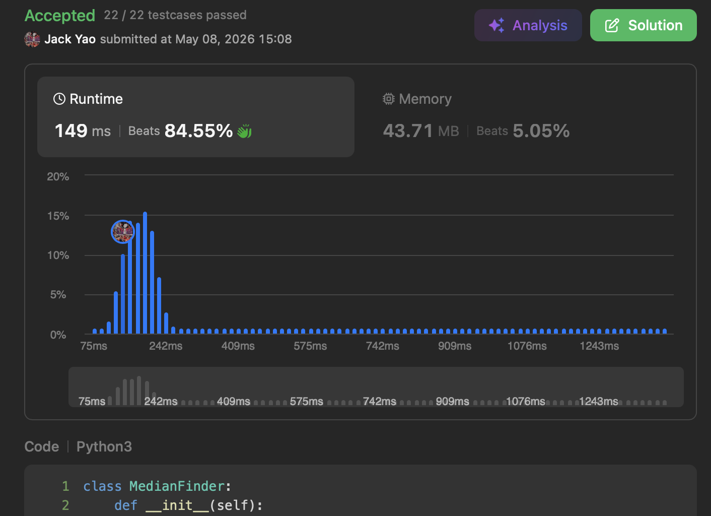

import Tabs from '@theme/Tabs';
import TabItem from '@theme/TabItem';
import CodeBlock from '@theme/CodeBlock';
import CppCode from '@site/docs/heaps/0295_hard/median_finder.cpp?raw';
import PyCode from '@site/docs/heaps/0295_hard/median_finder.py?raw';


## [Find Median from Data Stream](https://leetcode.com/problems/find-median-from-data-stream/description/)
A key application of heaps: not just tracking real-time minimum or maximum,

but also __tracking real-time median in a data stream__.


## Definition of Median in a Data Stream
- Length $n$ is odd: after sorting, __the middle element__. Like, median of $[1, 2, 3]$ is $2$
- Length $n$ is even: after sorting, __the average of two middle elements__. Like, median of $[1, 2, 3, 4]$ is $(2 + 3) / 2 = 2.5$

With definition in place, the question becomes:

as new numbers keep arriving, how do we always know the current median?


## What Sorting Implies
__A sorted sequence can naturally be split into a lower half and an upper half.__

__"Maximum" of lower half $\leq$ "minimum" of upper half.__

So we prepare a ```min_heap``` and a ```max_heap```:

```min_heap``` maintains upper half, ```max_heap``` maintains lower half.

Two conditions must maintain:

I. __Either both heaps have the same size, or ```min_heap``` has exactly one more element than ```max_heap```__

When the data stream has an odd number of elements, __the median lives in ```min_heap```__,

which is also when ```min_heap``` has one more element.

This is simply my preference to place median in upper half — lower half works too, just be consistent.

II. __Maximum of ```max_heap``` $\leq$ minimum of ```min_heap```__

If this isn't satisfied, keep swapping between two heaps until it is.


## When a New Element Arrives, Check Heap Sizes First
- If both heaps are the same size, push new element into ```min_heap```.

- If ```min_heap``` has one more element than ```max_heap```, push into ```max_heap```.

__condition I is now satisfied.__

Next, check whether __heaps need rebalancing__:

if maximum of ```max_heap``` $>$ minimum of ```min_heap```,

__promote ```max_heap```'s maximum to ```min_heap```__,

__and demote ```min_heap```'s minimum to ```max_heap```__.

Keep swapping until:

__maximum of ```max_heap``` $\leq$ minimum of ```min_heap```__

__At this point, condition II is also satisfied 👌👌__


## Find the Median: Back to Heap Sizes
A. If ```min_heap``` has one more element than ```max_heap```,

the median is minimum of ```min_heap```.

B. If both heaps are the same size, the median is

the average of ```min_heap```'s minimum and ```max_heap```'s maximum.


## Python and C++ Defaults Differ ⚠️
__Python's heapq defaults to a min heap.__

__C++'s priority_queue defaults to a max heap.__

For the half that isn't default, remember to negate values: __add a negative sign__.

So that a default min heap can act as a max heap, and vice versa.

<Tabs>
  <TabItem value="cpp" label="C++">
    <CodeBlock language="cpp">{CppCode}</CodeBlock>
  </TabItem>

  <TabItem value="python" label="Python" default>
    <CodeBlock language="python">{PyCode}</CodeBlock>
  </TabItem>
</Tabs>

LeetCode's ```addNum``` and ```findMedian``` on the problem page

correspond to my ```add_num``` and ```find_median```.

I use 🐫 camelCase in C++ and 🐍 snake_case in Python. Just a personal habit.


Adding a new element takes $O(\log n)$ time to maintain heaps.

Finding median takes $O(1)$. Space is naturally $O(n)$ throughout.

I highly recommend [Professor Tim Roughgarden's algorithms course](https://youtu.be/mNYHDv7SbDI?si=QiBFwiNTJamQrebN).

Beyond median maintenance, it covers many fascinating heap applications and fundamentals of how heaps work.
