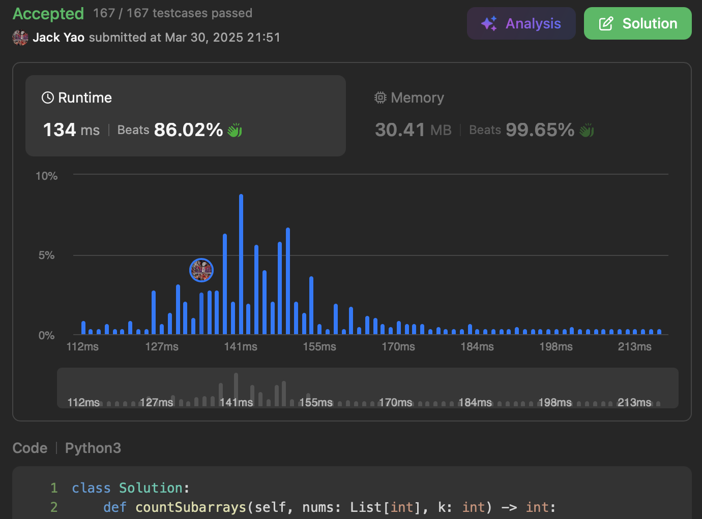

import Tabs from '@theme/Tabs';
import TabItem from '@theme/TabItem';
import CodeBlock from '@theme/CodeBlock';
import CppCode from '@site/docs/prefix_sum/2302_hard/subarray_scores.cpp?raw';
import PyCode from '@site/docs/prefix_sum/2302_hard/subarray_scores.py?raw';


## [Count Subarrays With Score Less Than K](https://leetcode.com/problems/count-subarrays-with-score-less-than-k/description/)
I'll be honest: when I first saw this problem, I was worried.

About what? Worried that in this __strictly positive integer array__ of length $n$,

for some subarray $nums[i: j + 1]$ with $i < j < n$,

the addition of $nums[j + 1]$ could somehow cause $\text{sum}(nums[i: j + 2]) \times (j + 2 - i) < k$ to hold,

forcing my left-to-right traversal to occasionally look back and handle cases

where subarray score suddenly drops.

But then...


## Would That Actually Happen in This Problem? 🤔
Input array contains only natural numbers. This means: given a left index $i$,

if right index $j$ causes $\text{sum}(nums[i: j + 1]) \times (j + 1 - i) \geq k$,

then any further right index $l$ will also cause $\text{sum}(nums[i: l + 1]) \times (l + 1 - i) \geq k$,

and by an even larger margin. __So the earlier worry was for a joke at all 🤣__


## Great! Let's Go Straight to It
We confidently adopt this strategy: __once $\text{sum}(nums[i: j + 1]) \times (j + 1 - i) \geq k$__,

__keep incrementing $i$ until $\text{sum}(nums[i: j + 1]) \times (j + 1 - i) < k$ finally holds, or $i > j$__.

Resulting values of $i$ and $j$ tell us: __among subarrays with right boundary at index $j$__,

__exactly $j + 1 - i$ of them satisfy the constraint on $k$__.

For each $j$, $i$ can go as far as $j + 1$, giving $j + 1 - i = 0$, meaning that

no subarray with right boundary at index $j$ satisfies our constraint.

As for why... see the follow-up problem section below.


## [Always Connect New Problems to Similar Solutions You've Written](https://starsexpress.github.io/SkyHorse/docs/queue/2398_hard/max_robots)
⬆️ The approach here is identical to problem 2398. In fact, it's a simplified version.

__Problem 2398 requires tracking window maximum, whereas problem 2302 doesn't ~~__

__So we save that $O(n)$ space which would've been needed for a monotonic decreasing deque__,

using just two pointers for sliding window's left and right ends,

plus a variable ```subarraySum``` to track $\text{sum}(nums[i: j + 1])$.


__Simplified down to just $O(1)$ space ~~ Time complexity remains linear $O(n)$.__


## What If the Input Has Both Positive and Negative Numbers?
[Algo Monster](https://algo.monster/liteproblems/2302) uses __binary search__ for problem 2302,

which __handles the case where input contains both positive and negative numbers__,

at the cost of $O(n \log n)$ time and $O(n)$ space.


## Reading Problem Carefully Matters. Remember Bayes' Theorem
If we only knew input contains integers but not whether they're positive or negative,

we'd only have prior probability $P(Y)$ and would need to use more cumbersome binary search as Algo Monster did.

But the problem states clearly: only natural numbers are given. __This is likelihood $P(X | Y)$ in hand__.

__So why not multiply it with prior to approach posterior $P(Y | X)$ and make a better judgment?__

__In a live coding interview, clarifying boundary constraints upfront is an essential skill.__

__A favor to both the interviewer and yourself.__

That's exactly what I did for problem 2302 — reducing complexity

from Algo Monster's $O(n \log n)$ time and $O(n)$ space down to $O(n)$ and $O(1)$.

<Tabs>
  <TabItem value="cpp" label="C++">
    <CodeBlock language="cpp">{CppCode}</CodeBlock>
  </TabItem>

  <TabItem value="python" label="Python" default>
    <CodeBlock language="python">{PyCode}</CodeBlock>
  </TabItem>
</Tabs>


## Follow-up Problem
When scanning subarrays with right boundary at index $j$,

if the left boundary $i$ increments all the way to $j + 1$,

what conclusion can we draw about $nums[j]$?
