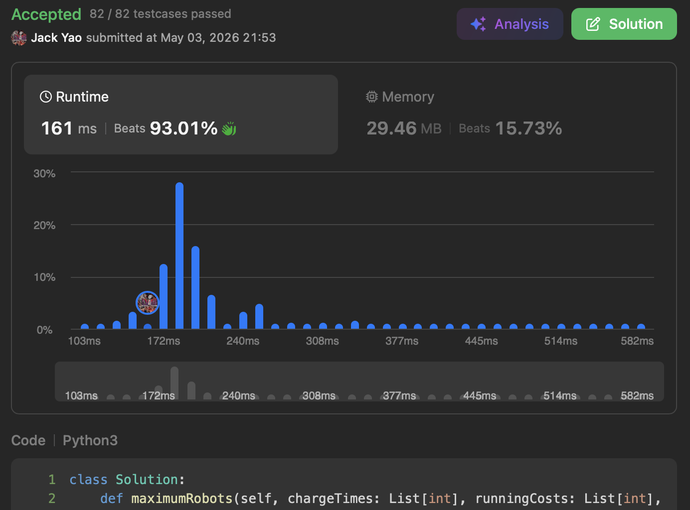

import Tabs from '@theme/Tabs';
import TabItem from '@theme/TabItem';
import CodeBlock from '@theme/CodeBlock';
import CppCode from '@site/docs/queue/2398_hard/max_robots.cpp?raw';
import PyCode from '@site/docs/queue/2398_hard/max_robots.py?raw';


## [Maximum Number of Robots Within Budget](https://leetcode.com/problems/maximum-number-of-robots-within-budget/description/)
Problem 2398 hovers around a __38% acceptance rate__,

yet it really just tests whether we know one fundamental skill: __reading the problem carefully__.

Once we do, we'll be confident that __monotonic deque + sliding window + prefix sum__ trio can take it down together.


## chargeTimes and runningCosts Are Always Natural Numbers
Our input has two arrays: ```chargeTimes``` and ```runningCosts```, both of length $n$.

Index $i$ holds the charge time and running cost of $i^{\text{th}}$ robot, respectively.

Both are __natural numbers__ — makes sense: a negative running cost would mean

suppliers are paying factories to take materials. Would you trust robots made like that?

Same for charge time — a negative value would mean the universe has collapsed, right?

Our third input is a positive integer ```budget```. The cost formula for running $k$ selected robots is:

Total cost = max charge time among $k$ robots + $k$ × sum of all $k$ robots' running costs

The question is: under budget, what's the maximum number of __consecutive__ robots that can run simultaneously?

Note the word __consecutive__ — __we can't pick robot $i$ and robot $i + 2$ while skipping robot $i + 1$__.

With this in mind, we notice a key insight: for $0 \leq i \leq j \leq l < n$,

once total cost of robots $i$ through $j$ exceeds budget,

__robots $i$ through $l$ will also exceed budget by an even wider margin__. Why?

```max(chargeTimes[i:j + 1])``` $\leq$ ```max(chargeTimes[i:l + 1])```. __The former is a subset of the latter__.

The "max charge time among $k$ robots" in this formula can only increase.

And since running costs are natural numbers, __```sum(runningCosts[i:l + 1])``` > ```sum(runningCosts[i:j + 1])```__.

$k$ only grows as more robots are added. All three components can't decrease, so neither can the total cost.

Conclusion: once robots $i$ through $j$ exceed budget, __robot $i$ must be dropped__ to have any chance of getting back under budget.

This is __monotonicity__: invalidated robots never become valid again.

Just keep scanning forward. No need to look back. We can smell an $O(n)$ solution within reach.

__Although suitable data structures are still required to actually realize monotonicity in $O(n)$__.


## Three Data Structures
### 1. Sliding Window: Define Search Range
From the above, we establish two pointers: ```startIdx``` and ```endIdx```,

representing robots at ```startIdx``` through ```endIdx``` — a total of ```endIdx``` + 1 - ```startIdx``` robots under evaluation.

__Once total cost exceeds budget, increment ```startIdx``` until cost is back within budget, or ```startIdx``` > ```endIdx```.__

### 2. Monotonic Deque: Max Charge Time in Window
When incrementing ```endIdx```, we need the max charge time among robots at ```startIdx``` to ```endIdx```.

Get a __monotonic decreasing deque__ to track it. Compare robot ```endIdx```'s charge time against deque's tail:

while tail's charge time $\leq$ charge time of robot at ```endIdx```, tail is irrelevant. Pop it.

Stop when deque is empty or tail's charge time > charge time of robot at ```endIdx```.

__Also, when ```startIdx``` increases, check if deque's front index has fallen out of window. If so, pop it.__

Remaining members naturally shift up, updating window's max charge time.

### 3. Prefix Sum: Total Running Cost in Window
Finally, maintain a variable ```windowTotalCost``` for total running cost of robots at ```startIdx``` to ```endIdx```.

When incrementing ```endIdx```: __add running cost of robot at ```endIdx``` to ```windowTotalCost```__.

When incrementing ```startIdx```: __subtract running cost of robot at ```startIdx``` from ```windowTotalCost```__.

This ensures an accurate window running cost at any moment.

Once ```startIdx``` stops rising, all robots in window won't exceed budget.

Robot count is __```endIdx``` + 1 - ```startIdx```__ (1).

As designed, ```startIdx``` may keep incrementing __until ```startIdx``` > ```endIdx```__.

For each ```endIdx```, ```startIdx``` can reach at most ```endIdx``` + 1. __But that's OK,__

because __count formula in (1) gives ```endIdx``` + 1 - ```startIdx``` = 0, meaning no robots are selected. A valid outcome__.

Now we just simply compare with respect to historical maximum and return it at the end ~~


__It really comes down to reading constraints carefully__, then figuring out

which structures best preserve correctness under those constraints. Both time and space: $O(n)$.

<Tabs>
  <TabItem value="cpp" label="C++">
    <CodeBlock language="cpp">{CppCode}</CodeBlock>
  </TabItem>

  <TabItem value="python" label="Python" default>
    <CodeBlock language="python">{PyCode}</CodeBlock>
  </TabItem>
</Tabs>


## Follow-up Problem
Looking back, do you still think the requirement to select __consecutive robots__ was just a redundant constraint? 🤓
