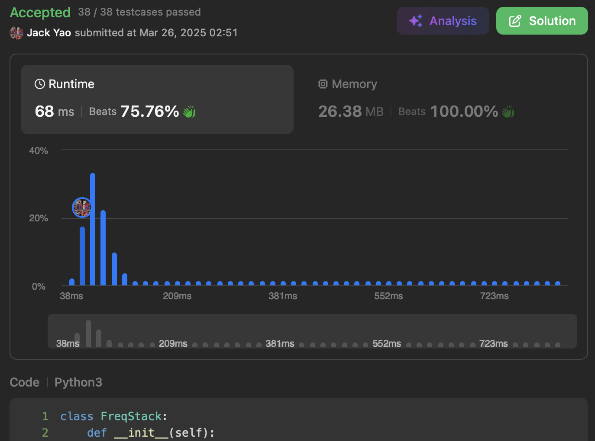

import Tabs from '@theme/Tabs';
import TabItem from '@theme/TabItem';
import CodeBlock from '@theme/CodeBlock';
import CppCode from '@site/docs/stack/0895_hard/max_frequency_stack.cpp?raw';
import PyCode from '@site/docs/stack/0895_hard/max_frequency_stack.py?raw';

## [Maximum Frequency Stack](https://leetcode.com/problems/maximum-frequency-stack/description/)
The key to this type of problem usually is understanding what `pop()` is supposed to do.

We need to remove and return the element with the highest frequency in stack.

__If multiple elements tie for highest frequency, pick the one closest to stack top__,
meaning the one that was pushed into most recently.

So we need to maintain a stack structure per frequency level,
ensuring that under a tiebreaker, the most recently added element is retrieved.

## Stack of Stacks
### Architecture
(1). __Frequency Stack__: __outer__ structure. Whenever current highest frequency
__has all its elements removed, that frequency is no longer maximum__.

It gets popped off the outer stack, letting next frequency take over outer stack top.

(2). __Element Stack__: __inner__ structure. Each frequency has its own element stack.

__Among elements at the same frequency, the one that most recently reached this frequency is at its inner stack top.__

This is exactly the tiebreaker of our problem.

So we maintain a `frequencyStack` as outer stack, where index $i$ represents frequency $i$.

Each frequency $i$ has its own inner stack storing all elements currently at that frequency.

### Method Implementation
I. `push(int value)`: when called, first increment `value`'s frequency in hash map.

Say the updated frequency is $x$.

Find the inner stack at index $x$ in outer stack and push `value` to inner stack top.

__If $x$ equals current length of outer stack, it means outer stack only reflects up to frequency $x - 1$__.

A new inner stack must be created at outer stack top to store frequency $x$.

II. `pop()`: each time it's called, locate outer stack top, at which there is an inner stack.

Pop the top element from this inner stack.

Decrement that popped element's frequency in hash table.

__This gives us the most recently pushed element among those with highest frequency.__

Then check if that popped element's inner stack is now empty.

If so, pop that inner stack off outer stack as well, accurately reflecting correct maximum frequency.

<Tabs>
  <TabItem value="cpp" label="C++">
    <CodeBlock language="cpp">{CppCode}</CodeBlock>
  </TabItem>

  <TabItem value="python" label="Python" default>
    <CodeBlock language="python">{PyCode}</CodeBlock>
  </TabItem>
</Tabs>

Both `push(int value)` and `pop()` run in $O(1)$ time. Space is $O(n)$.

Don't use heaps like [Algo Monster](https://algo.monster/liteproblems/895) and end up with $O(\log n)$ time complexity.
