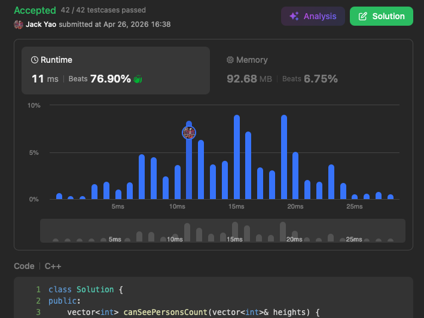

import Tabs from '@theme/Tabs';
import TabItem from '@theme/TabItem';
import CodeBlock from '@theme/CodeBlock';
import CppCode from '@site/docs/stack/1944_hard/visible_people.cpp?raw';
import PyCode from '@site/docs/stack/1944_hard/visible_people.py?raw';

## [Number of Visible People in a Queue](https://leetcode.com/problems/number-of-visible-people-in-a-queue/description/)
A very fun hard problem. I'll admit the math formula initially caught me off balance.

## What Does It Mean to See Someone at your Right?
According to definition: in a queue of $n$ people,

for indices $i$ and $j$ with $0 \leq i < j < n$,

person $i$ can see person $j$ __only if everyone between them is shorter than both of them__.

In math: __$\min(heights[i], heights[j]) > \max_{i < k < j}(heights[k])$__

## What the Formula Reveals
For any $0 \leq i < j < n - 1$: __if person $j + 1$ is not taller than person $j$,__

__person $i$ and person $j + 1$ will never satisfy that math formula above.__

Person $i$ can't see person $j + 1$.

At this point, don't you feel __monotonicity 😀__?

Combined with a right-to-left traversal: when person $j + 1$ is processed,

person $j$ comes next, and person $i$ comes later.

Person $j + 1$ is immediately eliminated as a candidate that any left-side person could see.

Eliminating candidates in last-in-first-out order. A stack style.

## The Mechanics
### Pop Move 🍿
Each time person $j$ is processed, compare stack top with person $j$.

__As long as the person at stack top is shorter than person $j$__, pop this person off,

and __increment person $j$'s rightward visibility count by one__.

Under this pop logic, everyone between the popped person and person $j$ is shorter than both.

When to stop popping? Stop when __the person at stack top is not shorter than person $j$__.

### Watch Out Details ㊙️
Once we reach the point where __the person at stack top is not shorter than person $j$__,

there's a subtle detail to handle carefully.

(1). First, __the person at stack top can definitely be seen by person $j$__,
regardless of whether they're taller or the same height.

Math formula from the start supports this. Increment person $j$'s rightward visibility count by one.

(2). Here's the tricky part: if the person at stack top is __taller__ than person $j$,

people to the left of person $j$ still have a chance to see this person at stack top,

since math formula can still be satisfied.

__But if the person at stack top is the same height as person $j$__,

__no one to the left of person $j$ can see this person at stack top__,

because math formula can no longer be satisfied.

So that equally tall stack top person must be popped immediately.

In short:

__both cases we increment person $j$'s rightward visibility count by one__,

__but only when the person at stack top equals person $j$'s height do we also pop stack__.

Don't mix them up. After handling these pops, push person $j$ onto stack.

<Tabs>
  <TabItem value="cpp" label="C++" default>
    <CodeBlock language="cpp">{CppCode}</CodeBlock>
  </TabItem>

  <TabItem value="python" label="Python">
    <CodeBlock language="python">{PyCode}</CodeBlock>
  </TabItem>
</Tabs>

Time complexity: $O(n)$ — each person is pushed once and popped at most once.

Space complexity: $O(n)$ — in the worst case, everyone is shorter than people to their right and stays in stack.
