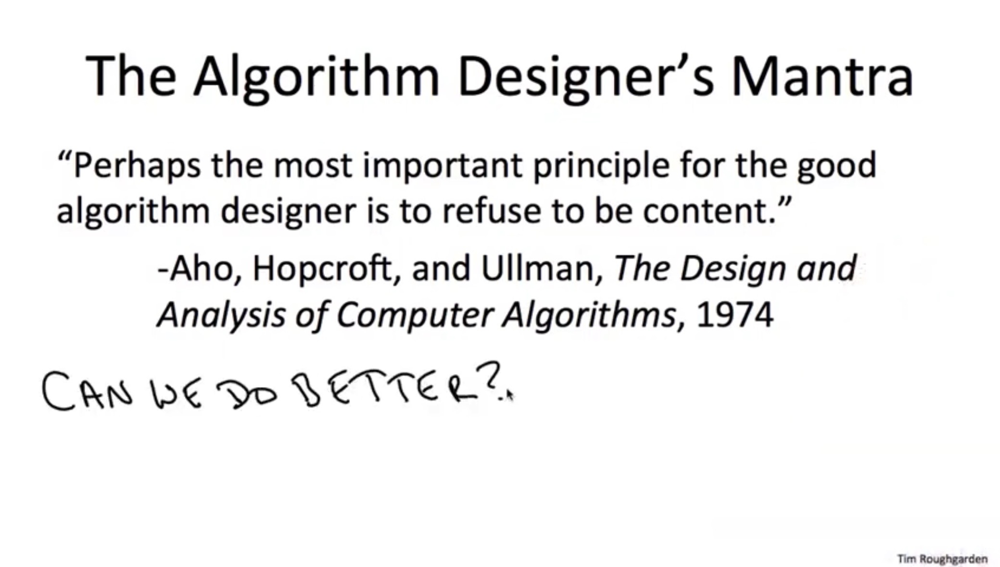

import Tabs from '@theme/Tabs';
import TabItem from '@theme/TabItem';
import CodeBlock from '@theme/CodeBlock';
import CppCode from '@site/docs/stack/2454_hard/second_next_greater.cpp?raw';
import PyCode from '@site/docs/stack/2454_hard/second_next_greater.py?raw';

## A Brief Review: First Next Greater Element
[Next Greater Element I](https://leetcode.com/problems/next-greater-element-i/description/)

[GeeksforGeeks explanation of First Next Greater Element](https://www.geeksforgeeks.org/dsa/next-greater-element/)

The First Next Greater Element problem is well-known.

On LeetCode it's problem 496, easy level.

Today we look at problem 496's twin: problem 2454, __hard level__.

## [Next Greater Element IV](https://leetcode.com/problems/next-greater-element-iv/description/)
Problem 2454 is called Next Greater Element IV, but __Second Next Greater Element is a more appropriate name__.

For each element $nums[i]$, we need to find the __second__ element to its right that is greater than it.

Finding just the first one isn't enough.

## How Popular Sites Handle Problem 2454
[Algo Monster](https://algo.monster/liteproblems/2454) uses pure binary search.

[LeetCode Wiki](https://github.com/doocs/leetcode/blob/main/solution/2400-2499/2454.Next%20Greater%20Element%20IV/README_EN.md) uses an ordered set with global sorting.

Both are $O(n \log n)$ solutions. They do get AC.

But... we can still follow professor Tim Roughgarden, former Stanford and now Columbia CS professor,

who opens data structures and algorithms lectures on YouTube and Coursera with this famous line:

[Professor Roughgarden's Courses Are Really Amazing](https://www.youtube.com/watch?v=yRM3sc57q0c&list=PLEAYkSg4uSQ37A6_NrUnTHEKp6EkAxTMa)

## How I Think About "Second" Next Greater
First, ask a foundational question:

what kind of element __has the right — or more precisely, the eligibility__ to ask "where is my Second Next Greater? 🥲"

It must be an element that has __already encountered its first right-side element greater than itself__,

and is now __searching for the next one greater than itself__.

__Searching for the next element to the right that is greater than itself__... doesn't that sound familiar?

An element that hasn't seen any right-side element greater than itself is __searching for the next element to the right that is greater than itself__.

So we immediately see: if element $x$ eventually finds its second next greater,

$x$ must have successfully completed __two rounds of "find the next greater element to the right"__.

Actions are the same for both times, but states differ:

1. First search: state of $x$— has not yet encountered any right-side element greater than itself.
2. Second search: state of $x$— has encountered exactly one right-side element greater than itself.

Since the first task is well-known to be solvable by a monotonic decreasing stack,

the second task can obviously also be solved with a stack — __no binary search or ordered set needed__.

We just need stack 1 for the first task and stack 2 for the second task, managing elements in different states.

During traversal of $nums$, when we reach element $y$:

first check stack 2 — while it has elements and its top is less than $y$,

congratulations, that top element has found $y$ as its second next greater.

Pop it off stack 2 and record $y$ as its answer.

Once stack 2 is empty or its top is no longer less than $y$, $y$ can no longer be anyone's second next greater.

Now $y$ checks stack 1 to see if it can be anyone's first next greater.

Similarly, while stack 1 has elements and its top is less than $y$, $y$ is that top element's first next greater.

Remove those elements off stack 1 and load them onto a vector serving as a transporter 🚚.

Once stack 1 is empty or its top is no longer less than $y$, $y$ enters stack 1 to wait for future.

Transporter vector 🚚 then heads to stack 2. One essential thing here:

since both stacks are monotonically decreasing, __elements were pushed onto transporter vector 🚚 in ascending order__.

When transporter vector 🚚 transfers elements to stack 2, __larger elements must enter stack 2 before smaller elements__.

Otherwise, we can't maintain stack 2's necessary monotonically decreasing property.

Since each element is traversed once, pushed into stack 1 exactly once, and enters stack 2 at most once,

__our double-stack approach runs in $O(n)$ time and $O(n)$ space__.

**My double stacks C++ code performance: AC in 31ms.**

(Quietly noting: Algo Monster and LeetCode Wiki's solutions took 350+ ms in C++,

__which stretched the time distribution chart significantly in the other direction__. See horizontal axis.)

## Takeaway: 2 = 1 + 1
Second next greater element problem __is essentially the identity 2 = 1 + 1 in action__.

__Think of it as doing first next greater element problem "twice"__, and you naturally arrive at double stacks solution.

In fact, the __team match process at big tech giants is a real-life second next greater element problem__:

__however, our array isn't infinite. Once inside stack 2, every traversed element is a chance to rise. Team match works this way.__

<Tabs>
  <TabItem value="cpp" label="C++" default>
    <CodeBlock language="cpp">{CppCode}</CodeBlock>
  </TabItem>

  <TabItem value="python" label="Python">
    <CodeBlock language="python">{PyCode}</CodeBlock>
  </TabItem>
</Tabs>

## Follow-up Problems
Now that we've seen both first and second next greater, consider:
1. For an array of length $n$, find $k^{\text{th}}$ greater element to the right for each element, where $k$ is a positive integer variable. What are our time and space complexities?
2. Following the above: does the __worst-case time complexity__ depend on $k$? If not, why not? What's time complexity in that case?
3. Continuing from question 1. For an array of length $n = 1,000,000$, which value of $k$ most easily produces results for all elements?
   (A) $k = 1$ (B) $k = 10^2$ (C) $k = 10^4$ (D) $k = 10^6$

Think through all three questions, and you'll have a solid grasp of the philosophy behind monotonic stacks 🤓
