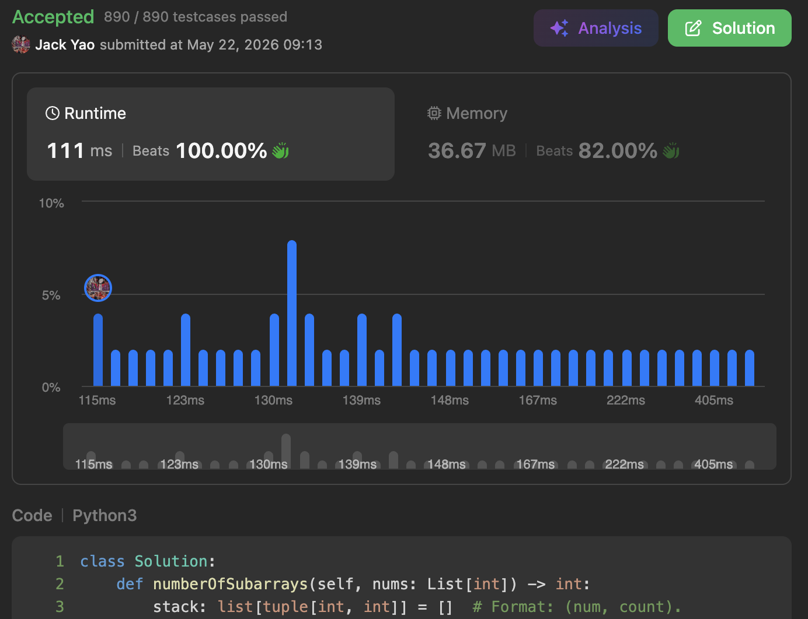

import Tabs from '@theme/Tabs';
import TabItem from '@theme/TabItem';
import CodeBlock from '@theme/CodeBlock';
import CppCode from '@site/docs/stack/3113_hard/max_boundary_subarrays.cpp?raw';
import PyCode from '@site/docs/stack/3113_hard/max_boundary_subarrays.py?raw';

## [Find the Number of Subarrays Where Boundary Elements Are Maximum](https://leetcode.com/problems/find-the-number-of-subarrays-where-boundary-elements-are-maximum/description/)
At first glance, this problem looks quite scary. AC rate is only ~$34\%$.

However, if we look closer, it's incredibly easy to capture core logic and AC instantly.

**I say, this nagging long title is just a bluff 👻**

## Boundary Elements Must Be the Maximum
The core property of all desired subarrays we need to find.

From here, we immediately lock down a vital observation when traversing `nums`:

### When traversing to $nums[j]$:
Any $nums[i]$ that satisfies $nums[i] < nums[j]$ where $i < j$

can't form a valid subarray $nums[i: k + 1]$, where $j \le k$, that meets required criteria.

__Why? All because $nums[i] < $nums[j]$.__

__$nums[i]$ as left boundary fails to be the maximum of this subarray.__

Any $nums[i]$ that satisfies $nums[i] < nums[j]$ with $i < j$

can be forever eliminated upon traversing to $nums[j]$.

### Continue From Above
Once we cancel out all $nums[i] < nums[j]$ where $i < j$,

remaining elements is either equal to $nums[j]$, or greater.

Our logic simplifies into two scenarios:

I. There is no $nums[i]$ equal to $nums[j]$ remaining,

when $nums[j]$ acts as right boundary, there is only one subarray satisfying requirement:

__yep, $nums[j]$ itself as a single-element subarray.__

II. There are existing elements $nums[i] = nums[j]$,

__which means we simply increment $Count_{nums[i]}$ by 1.__

Incremented $Count_{nums[i]}$ represents total number of valid left boundaries

that can pair with the right boundary $nums[j]$.

### In Short
__Both scenarios include the case of $nums[j]$ forming a valid subarray by itself.__

__However, scenario II also captures when prior identical elements pair up as left boundary.__

## Monotonicity Again
As of now, you've probably realized that this problem is all about monotonicity.

We implement aforementioned strategy via a __strictly decreasing stack__.

When traversing to $nums[j]$, as long as the stack isn't empty,

__and top element satisfies $nums[i] < nums[j]$, we pop stack.__

After popping all smaller elements,

we might find that stack top has an element  __exactly equal to $nums[j]$__.

If so, just do increment: $Count_{nums[i]} += 1$.

Otherwise, we push $nums[j]$ into the stack with $Count_{nums[j]} = 1$.

__Valid left boundaries that right boundary $nums[j]$ can pair: the count attached to stack top's element.__

An essential implementation detail: __the count is tied to its respective element itself.__

__When popping, $Count_{nums[i]}$ is also popped away.__

All we have to do now is push $nums[j]$ along with its count into the stack,

and accumulate its count into our final answer `subarrays_count`.

<Tabs>
  <TabItem value="cpp" label="C++">
    <CodeBlock language="cpp">{CppCode}</CodeBlock>
  </TabItem>

  <TabItem value="python" label="Python" default>
    <CodeBlock language="python">{PyCode}</CodeBlock>
  </TabItem>
</Tabs>

Both time and space complexities align with typical monotonic stack problems: clean $O(n)$.

Once we see through the traversal elimination mechanism, this problem is an easy AC~~

## Follow-up Problems
What are the lower and upper bounds for our final answer `subarrays_count`?
