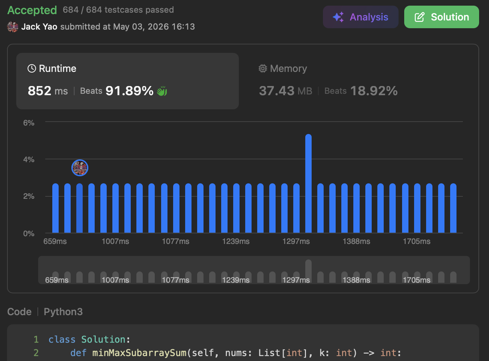

import Tabs from '@theme/Tabs';
import TabItem from '@theme/TabItem';
import CodeBlock from '@theme/CodeBlock';
import CppCode from '@site/docs/stack/3430_hard/subarrays_max_min_sum.cpp?raw';
import PyCode from '@site/docs/stack/3430_hard/subarrays_max_min_sum.py?raw';

## [Maximum and Minimum Sums of at Most Size K Subarrays](https://leetcode.com/problems/maximum-and-minimum-sums-of-at-most-size-k-subarrays/description/)
On closer inspection, this problem really only tests two things:

1. __Whether we're familiar with basic properties of monotonic stacks__
2. __Whether we can integrate a monotonic stack with other data structures__

## Making Traversal Logic Convenient
The task is to find maximum and minimum of every subarray of length at most $k$ for input array,
and return the summation of all those maximums and minimums.

Most natural traversal approach is to __let each visited index $i$ serve as subarray's right end__,
then look at all valid subarrays ending at $i$ to find their respective max and min.

This ensures we capture exactly the right information. Nothing more and nothing less.

Since our problem limits subarray __length to at most $k$__, we must __control which starting indices $j$ are valid__ for the current right end $i$.

My habit for subarray-style problems is to __let the visited index $i$ be subarray's right end__,
so I can look left to filter valid starting indices $j$ — whether moving, counting, summing up, or multiplying.

Biggest advantage is the traversal logic becomes genuinely convenient.

## Boundary Control
When index $i$ serves as right end, first thing we do is determine which starting indices $j$ are __valid__:

those $j$ satisfying $\max(0, i - k + 1) \leq j \leq i$.

Once valid range for $j$ is established, the harder part follows.

## Efficiently Finding Subarray Max and Min
The answer we need is __$S = \Sigma_{i = 0}^{n - 1} (MaxSum_i + MinSum_i)$__:

I. $MaxSum_i = \Sigma_{j = max(0, i - k + 1)}^i \max(nums[j:i + 1])$

— sum of maximum values across all valid subarrays ending at $i$.

II. $MinSum_i = \Sigma_{j = max(0, i - k + 1)}^i \min(nums[j:i + 1])$

— sum of minimum values across all valid subarrays ending at $i$.

How do we compute these two sums efficiently?

### I. Starting From Default Case
__Start with $MaxSum_i$ inheriting the value of $MaxSum_{i - 1}$__, then make two adjustments:

__Always happens__: add $nums[i]$ for its contribution as a maximum, as there's now a single-element subarray $nums[i]$.

__Conditional__: if $i - k + 1 > 0$, subtract the max value of subarrays containing $nums[i - k]$.

__The subarray $nums[i - k:i]$ of length $k$ was valid when subarray's right end was $i - 1$.__

Now that $nums[i]$ enters, __the leftmost element $nums[i - k]$ must retire to let subarray length stay at $k$__.

This is why we do boundary control. After these adjustments, scan for any further corrections.

### II. Incremental Comparison: Responsibilities Transitions
Every valid subarray ending at $i$ contains $nums[i]$.

So if $nums[i] \geq nums[i - 1]$ (1), none of these subarrays can have $nums[i - 1]$ as their maximum.

Why include equality? We traverse left to right,
__if two adjacent elements are equal, definitely prefer the newer one: it arrived later so it can stay longer 😁__

In this case, $nums[i - 1]$ was the maximum for $l$ times of all valid subarrays ending at $i - 1$.

__Those $l$ times are now fully transferred to $nums[i]$__, producing a net increase of

__$(nums[i] - nums[i - 1]) \times l$__ added to $MaxSum_i$.

Since $nums[i]$ unseated $nums[i - 1]$, it must also compare against $nums[i - 2], \ldots, nums[max(0, i - k + 1)]$.

When do we stop? __When we hit the first $nums[j]$ that is greater than $nums[i]$.__

__Everything to the left of $nums[j]$ is even larger, so $nums[i]$ can't beat them.__

Isn't this a monotonic decreasing stack approach?

Pop all elements that aren't greater than $nums[i]$, collect their transferred shares, and push $nums[i]$ into stack.

Since $MaxSum_i$ can be tracked in real time using a monotonic decreasing stack,
$MinSum_i$ can naturally be handled with a monotonic increasing stack.

__Only difference: transfer condition flips. For monotonic increasing stack, $nums[i] \leq nums[i - 1]$ triggers handoff (2),__

__Which is the opposite inequality compared to (1) for $MaxSum_i$.__

### III. Monotonic Stack Meets Queue
As mentioned, every iteration enforces boundary control.
Have to discard max/min contributions from subarrays that are no longer in current valid range.

__Such a removal is FIFO, so we merge queue and monotonic stack into a deque that supports both FIFO and LIFO.__

__Each element on stack is a tuple of (Index, Number, Shares)__, each field is a critical role:

__I. Index__: we need to know where the max/min element is located.

This allows boundary control to determine __when it falls out of current window and must retire__.

__II. Number__: numerical value of the max or min is needed, since both stacks are __always comparing against newly visited element__.

__III. Shares__: among all valid subarrays ending at the current index,
the __contribution count__ of an element serving as the max (in decreasing stack) or min (for increasing stack).

Which is actually the $l$ from our handoff explanation above. It's what allows $MaxSum_i$ and $MinSum_i$ to correctly adjust.

Think of it like bonuses: issued upfront at an estimated amount, __then corrected at the end based on actual performance__.

Each element enters both stacks exactly once for each. Every element leaves two stacks at most twice in total.
Time and space complexity: $O(n)$.

<Tabs>
  <TabItem value="cpp" label="C++">
    <CodeBlock language="cpp">{CppCode}</CodeBlock>
  </TabItem>

  <TabItem value="python" label="Python" default>
    <CodeBlock language="python">{PyCode}</CodeBlock>
  </TabItem>
</Tabs>
