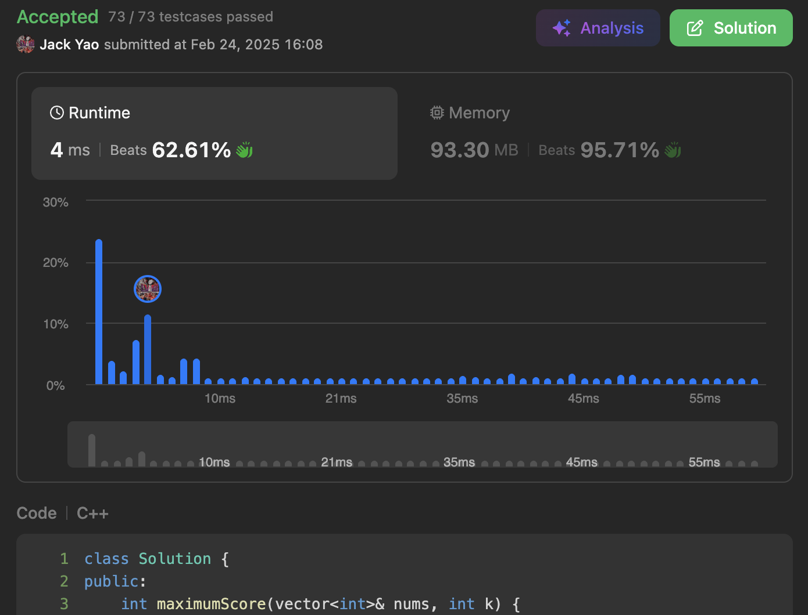

import Tabs from '@theme/Tabs';
import TabItem from '@theme/TabItem';
import CodeBlock from '@theme/CodeBlock';
import CppCode from '@site/docs/two_pointers/1793_hard/good_subarray_score.cpp?raw';
import PyCode from '@site/docs/two_pointers/1793_hard/good_subarray_score.py?raw';

## [Maximum Score of a Good Subarray](https://leetcode.com/problems/maximum-score-of-a-good-subarray/description/)
From this problem's definition of a good subarray's boundaries:

Left Boundary $\leq k \leq$ Right Boundary,

we can see that every candidate subarray must contain $nums[k]$.

## Since $nums[k]$ Is A Must
Why not let $nums[k]$ be the center of our greedy search?

Set up two pointers: `leftIdx` and `rightIdx`.

One scans from $k$ to left, the other scans from $k$ to right.

Each step goes into one of three cases:

I. Both `leftIdx` and `rightIdx` are in bounds.

Compare `nums[leftIdx]` and `nums[rightIdx]`.

The bigger one becomes the new member to extend current subarray.

Why pick the bigger one: subarray score = subarray minimum * subarray length.

A bigger new member is more likely to maintain the subarray minimum,

or at least minimizes the drop from minimum.

II. `leftIdx` is out of bounds. Only `rightIdx` can increment.

III. `rightIdx` is out of bounds. Only `leftIdx` can decrement.

Such a design covers all subarrays having $nums[k]$.

After each step, compute current subarray's score,

comparing it with `maxScore` and update when necessary.

Time complexity is $O(n)$. Each element is visited exactly once.

Space complexity is $O(1)$. We just need two pointers,

current subarray minimum & score, and historical max score. 5 variables after all.

BTW, this greedy two pointers approach was later submitted as a pull request by me,

[and was merged into LeetCode Wiki, reducing space complexity from $O(n)$ to $O(1)$.](https://github.com/doocs/leetcode/pull/5215)

<Tabs>
  <TabItem value="cpp" label="C++" default>
    <CodeBlock language="cpp">{CppCode}</CodeBlock>
  </TabItem>

  <TabItem value="python" label="Python">
    <CodeBlock language="python">{PyCode}</CodeBlock>
  </TabItem>
</Tabs>
